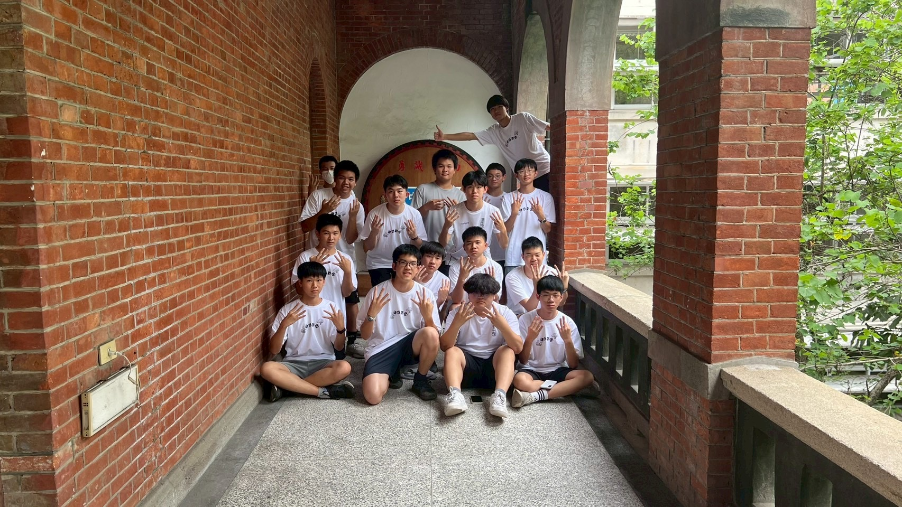
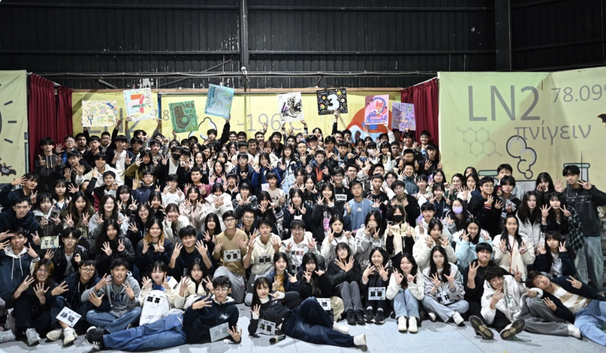
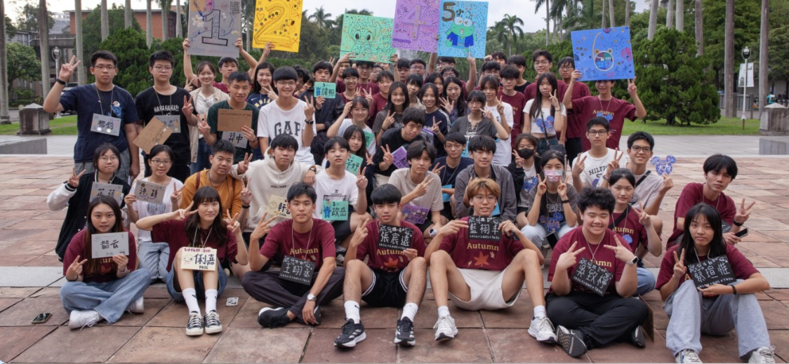

# 科研是什麼？
科學研習社，簡稱科研，是建中知名的學術性的社團。我們每週五的社課主題橫跨數學、物理、化學、生物、地科、人文六大領域。除了每週固定的社課，放學後還會不時舉辦各種有趣的聯課與實驗課，更常常和友社合辦大大小小的活動。如果你想學各種酷酷的知識，或是結交一堆很強、很電的神人朋友，科學研習社絕對是你的不二之選！

# 小社課
在放學後，我們不定期會舉辦一些和友社們一起的聯課以及實驗課，其中，我們的友社包含了北一附中成功中山景美等，所以也不用擔心到時候沒有別的人會很無聊的問題！

# 活動
在這一學年當中，我們的活動有迎新、中研院慶、秋遊、聖晚、寒訓、元晚、社展等，在這些活動中，你們都可以去認識到許多的人，更可能在其中遇到知己！並成為很好很好的朋友。

# 科研大家庭
我們沒有什麼學長學弟制，正地社我們也都一視同仁，只要你是喜歡我們科研的，那你就是我們的一家人，我們也和北科的關係很好，而那些更大的學長姐們也時常會在活動的時候回來看我們。比起社團，我們科研更像是一個大家庭。

這是我們的ig帳號，可以去看看喔！
[https://www.instagram.com/cksc_43rd]
