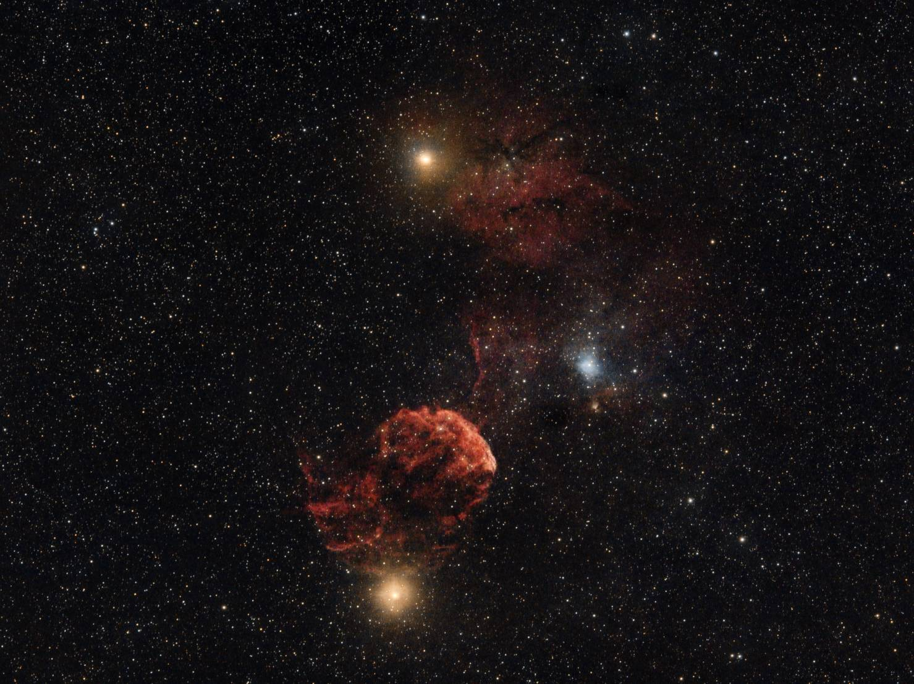
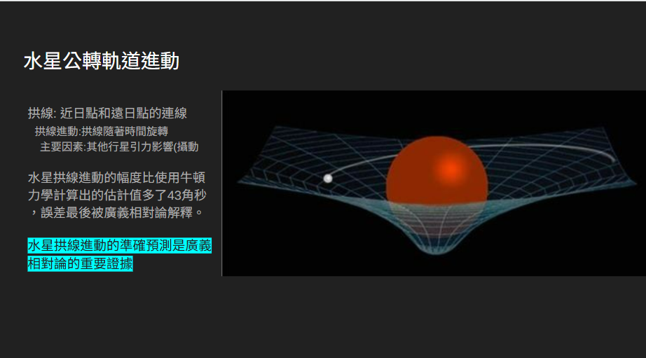
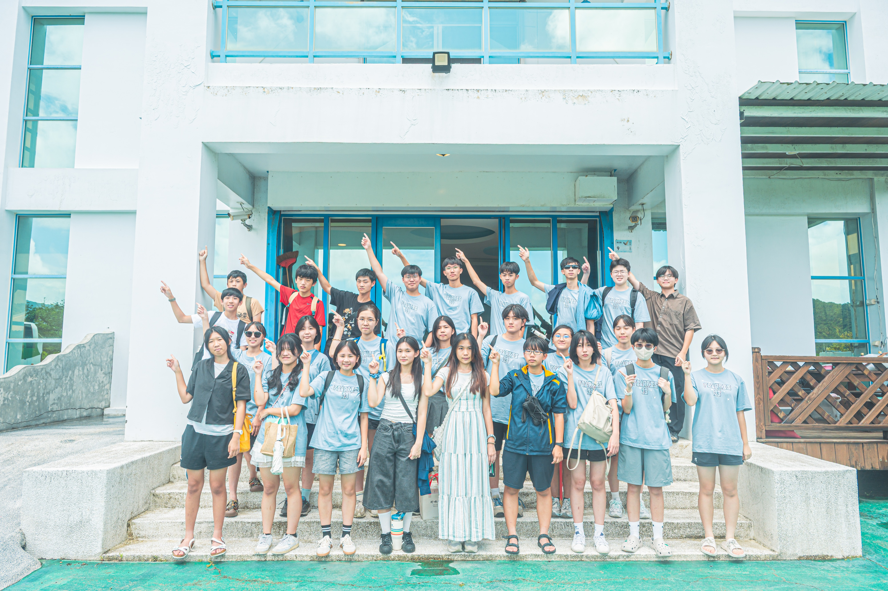
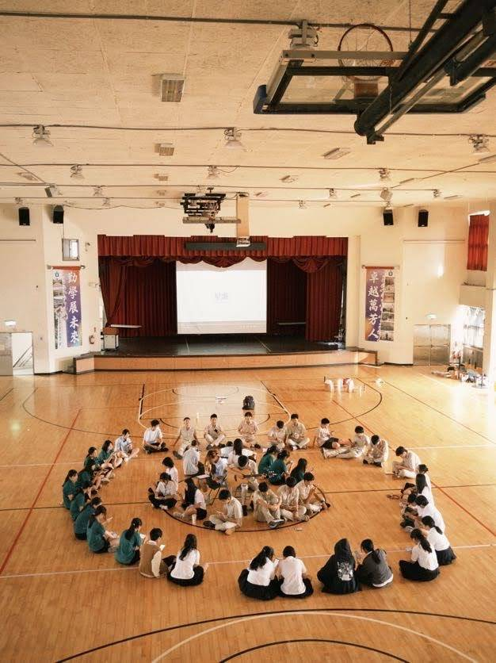
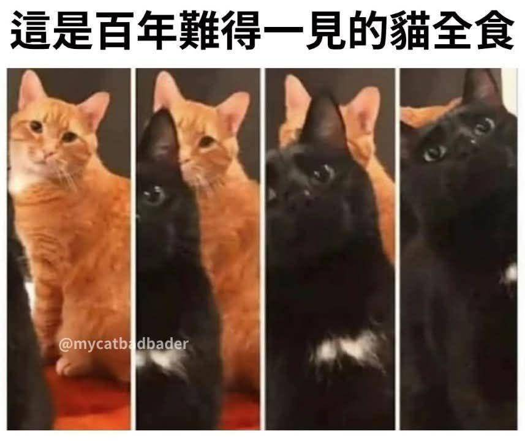

<天文社在幹嘛>
天文社主要在學習天文知識、拍攝深空天體、當然還有看星星。學習從行星軌道、星系演化到宇宙學的知識，拍攝從銀拱、月食到深空天體，更會跟友社一起跑上山過夜看星星。

<天文知識怎麼學>
我們會系統性的教學，從社課、小社課、聯課到公開課，(除了社課都是自由參加)會從基礎開始教學，也會慢慢過渡到更高階的課程，如果你本身就是天文大佬也可以找教學組學長交流。這學期我們也會先調查學弟的喜好方向(EX：宇宙學、恆星科學、黑洞)再調整教課方向。

<出門觀測>
所謂的觀測當然就是出門看星星，當然是每個新月都要出門囉！
其中又包含過夜好幾天的大觀(寒暑訓)、週末兩天一夜的小觀(建北景武聯合小觀、北集星小觀、社內小觀)，只要你有時間，絕對有玩不完的活動！

<觀測夥伴一起出發吧>
我們跟北一天文與地科社、中山地科社、萬芳天文社共同組成了「北集星」，是一個會常常一起辦活動的天文團體。除此之外也會偶爾跟成功天文社、武陵天文社、景美天文社等其他天文性質的社團出觀。總之是有滿滿的同好小夥伴，一起出門看星星！

<學長你真的不學帝雉嗎>
天文社就是chill 
