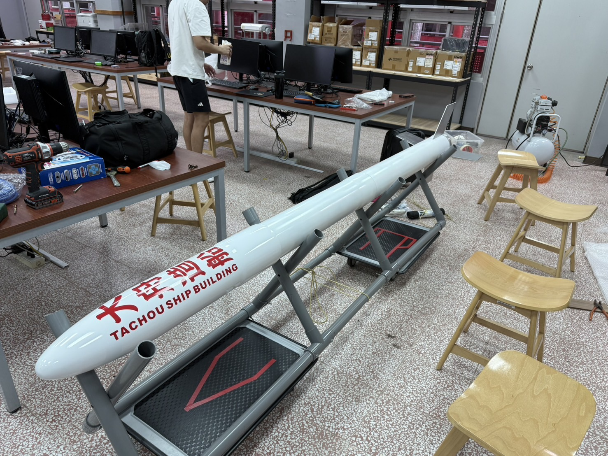
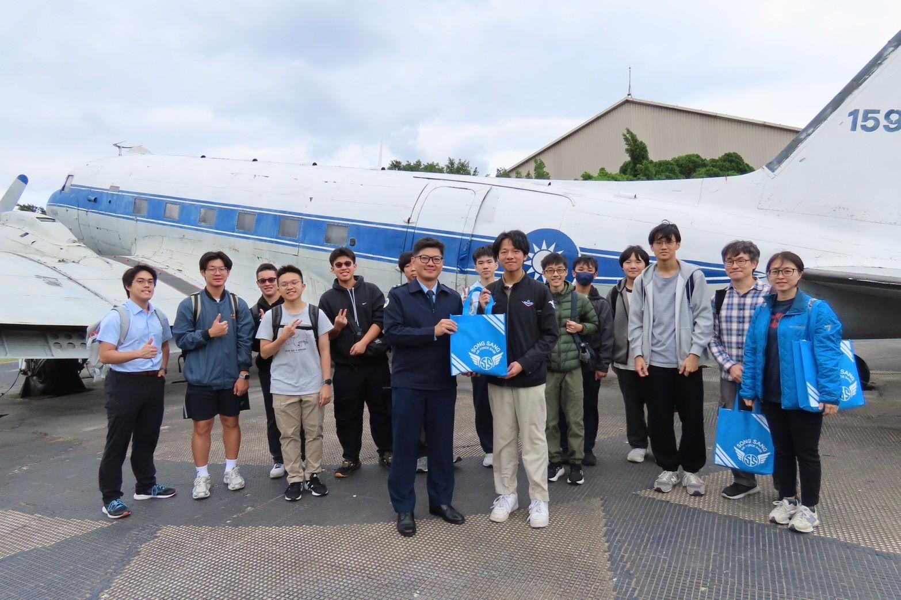
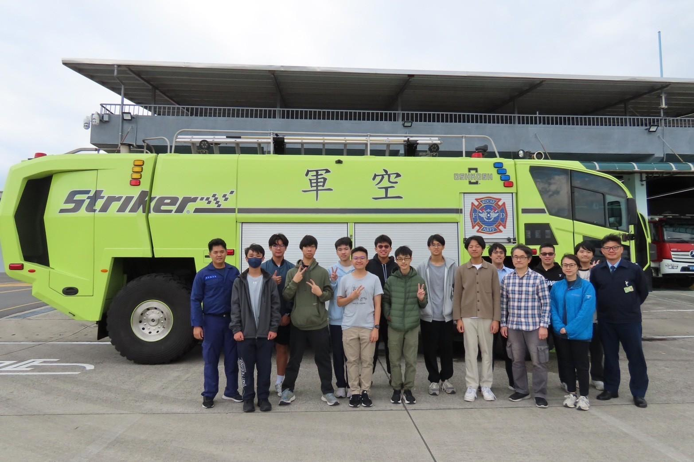
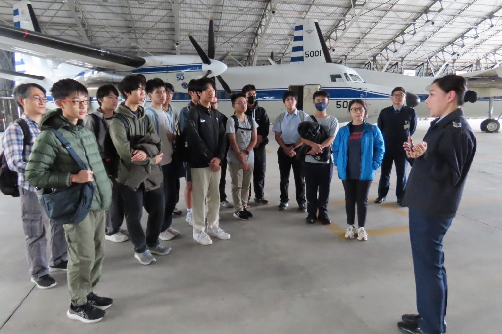

## ✈️ 航空社都是誰在加？

我們是由一群對航空充滿熱情的學長們組成的社團，我們社擁有建中數一數二悠久的社團歷史。不用擔心，就算你對飛機沒興趣，這裡也能讓你學到豐富的物理與機械知識。

---

## 🛠️ 航空社在幹嘛？

### 📚 常規社課
* **實作**：打造屬於自己的手擲機與小火箭
* **航空專業**：民航概論
* **進階挑戰**：如果大家有興趣，也會帶大家一起做**遙控飛機**！

### 🚀 社課以外的活動
* **專業競賽**：參加國家太空中心舉辦的 **台灣盃火箭競賽**
* **實地參訪**：參訪機場管制區、航空基地等難得的活動！

---

## 🏫 有機會跟友社接觸的機會嗎？

我們會和其他學校的友社舉辦連課，至於會和哪些友社舉辦呢？敬請期待！

---

## 🤷‍♂️ 可以地社嗎？

**熱烈歡迎！** 

我們預計每週舉辦一至兩次小社課，地社同學也都能來參與。

---

## 🙋‍♂️ 還有其他問題嗎？
歡迎隨時私訊航空社 IG，我們會盡快回覆您！

## ✈️ **航空社期待您的加入！**
