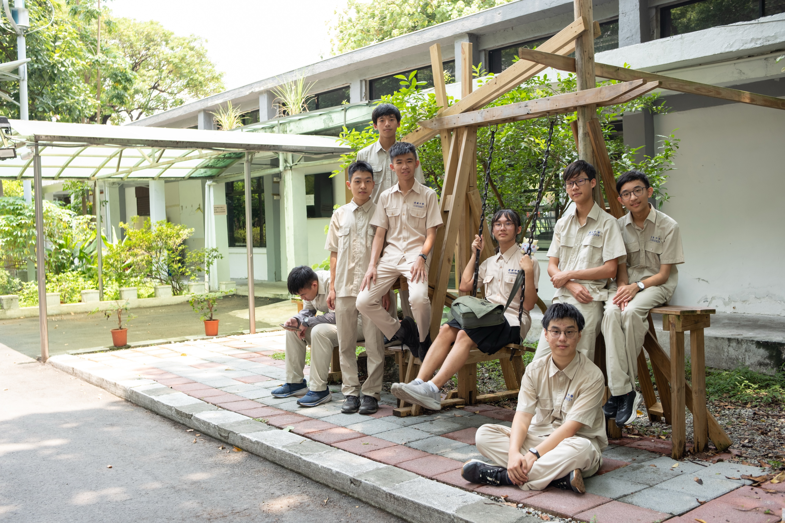
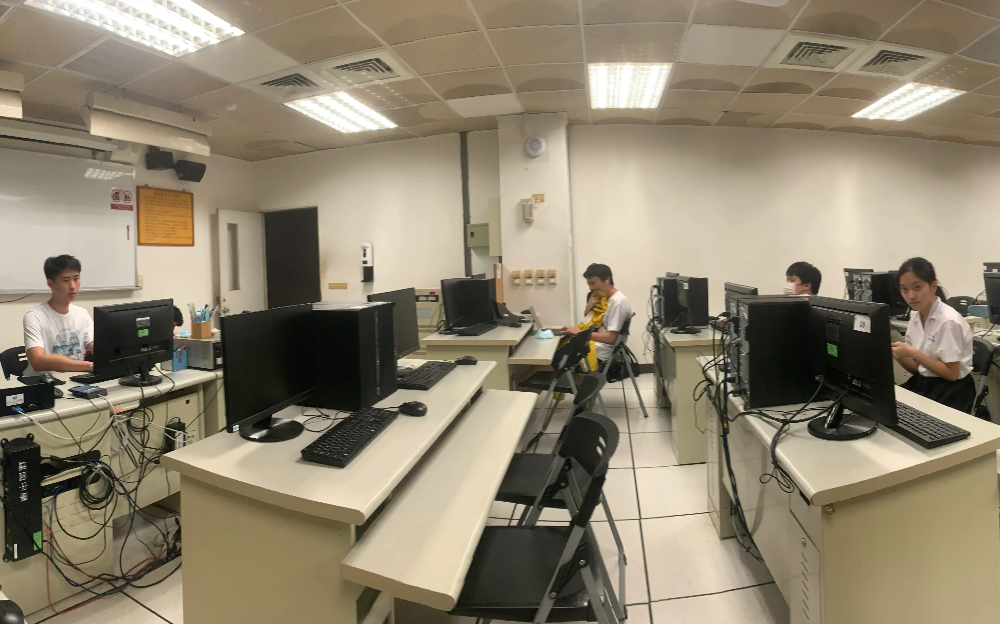
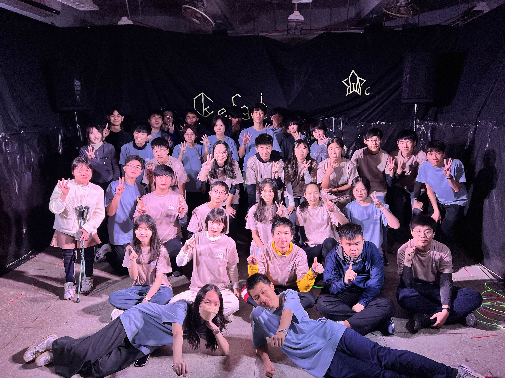

# 建電在做什麼？

建中電子計算機研習社，簡稱建電，是一個以資訊科技為主的社團。我們會接觸 Python、C++、網頁、Unity、資安、AI 等不同領域，不只是坐在電腦前寫程式。即使完全沒有基礎也不用擔心，課程大多會從零開始。建電也和北一女資訊研習社關係密切，兩社合稱 **建北電資**，平時會一起上課、辦活動。

# 大社課與小社課

除了學校社團時間的大社課，平日放學後也有自由參加的小社課。每天的主題不同，可以只選自己有興趣的課，也可以每天留下來學。課程主要由高二學長姊準備，不論是第一次接觸程式，還是已經有經驗、想繼續深入，都能找到適合自己的內容。

# 不只有寫程式

建北電資一年中還有暑訓、秋遊、寒訓、春遊等四大活動，以及迎新、幹見、社展等大小活動。除了上課，也會一起玩遊戲、出遊、吃飯，或把一年中完成的作品拿出來展示。社團生活不只是學到多少技術，和大家一起留下的回憶也同樣重要。

# 歡迎加入建電

建電不分正社、地社，也沒有學長學弟制。Discord 裡平常除了討論程式，也會聊天、分享有趣的東西或揪人玩遊戲。無論你已經是電神，還是連 Python 是什麼都不知道，只要對資訊有一點興趣，都歡迎加入我們。

都看到這裡了，就來建電吧！⚡

建電 IG：[ckeisc_46](https://www.instagram.com/ckeisc_46th)
