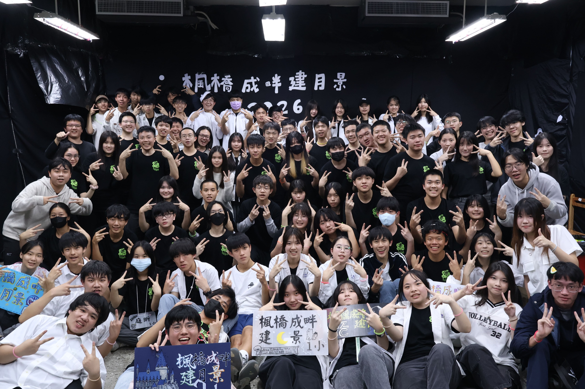

# IZCC
IZCC是一個溫暖的大家庭，組成的成員有:建中資訊社(INFOR)、中山女高資訊研究社(ZSISC)、成功高中電子計算機研習社(CKCSC)、景美女中電腦資訊社(CMIOC)，我們的活動大多會與這幾個社團合辦，大家都是對資訊充滿熱情的人，來這裡可以不僅可以認識友校的好朋友，也可以與大家互相切磋。

# 社課
我們的社課會在每周五的下午第一節進行上課，會上Python、JavaScript等，上課的內容會從必較基礎的開始教學，就算是零基礎也不用害怕學長會細心的教導你，就算不會也會讓你問到會。

# 放課
放課則會在每周一到五的晚上18:00~20:00與IZCC的大家一起進行，課程會教演算法、網頁前端等，課程會較為深度，不過也不需要擔心都會從基礎開始，如果認真學也是可以收穫滿滿，也可以來這裡與講師同屆互相切搓。

# 春遊&秋遊
想要在段考後的周末放鬆一下與同屆們一同出遊互相認識嗎?來春秋遊就對了，我們會有各式好玩的活動，像是槍戰、烤肉、桌遊等，在這一天可以與同屆與長姊互相交流認識，絕對能讓你玩得盡興!

# 暑訓&寒訓
在暑假與寒假，我們會準備為期七天的營隊，在這之中會有許多長姊準備的課程，與穿插其中的趣味遊系像是大地遊戲、團康遊戲、RPG等，能讓你在閒暇的寒暑假學習到許多新知並且為這個寒暑假帶來許多珍貴的回憶，絕對讓你不虛此行!

# 其他活動
我們還有迎新、耶誕晚會、社慶、聯課等活動，等著你來解鎖!

# 其他事項
我們是一個沒有「學長學弟制」的社團，但我們有「學長學帝雉」的傳統，歡迎對資訊有興趣的學弟們加入我們資訊社溫暖的大家庭
建中資訊社IG帳號:infor_39th
