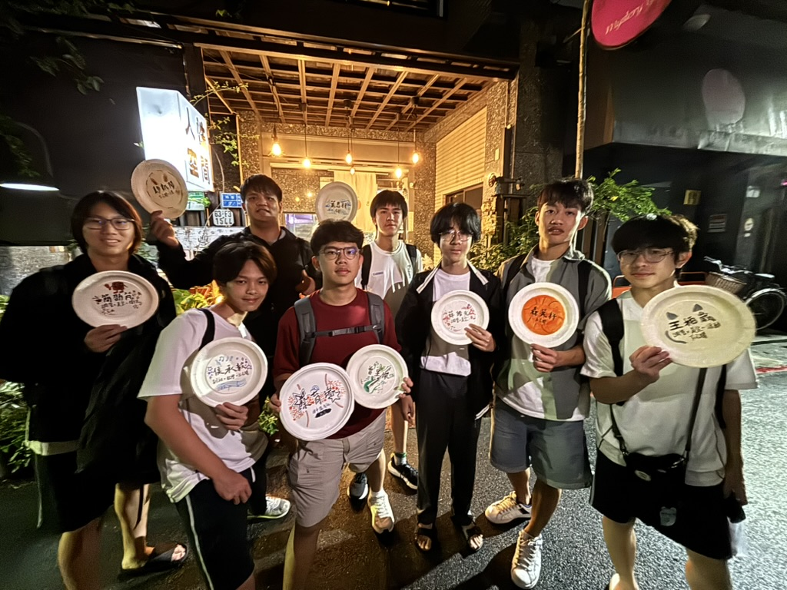
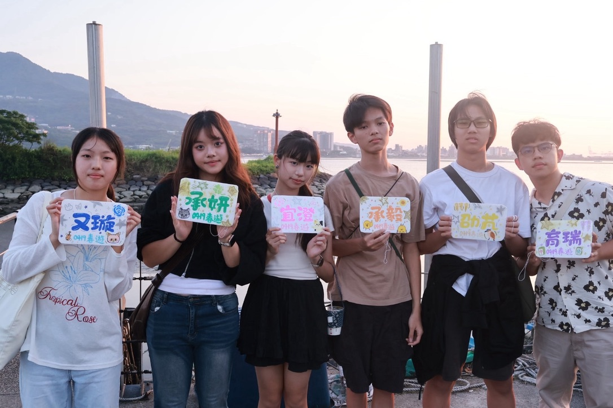
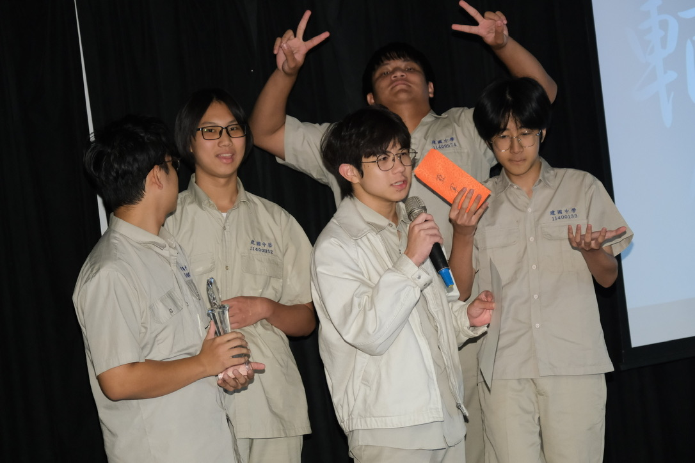
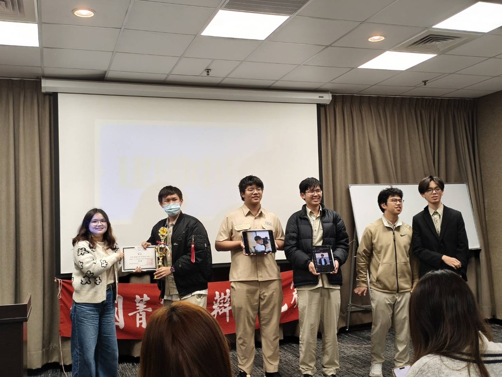
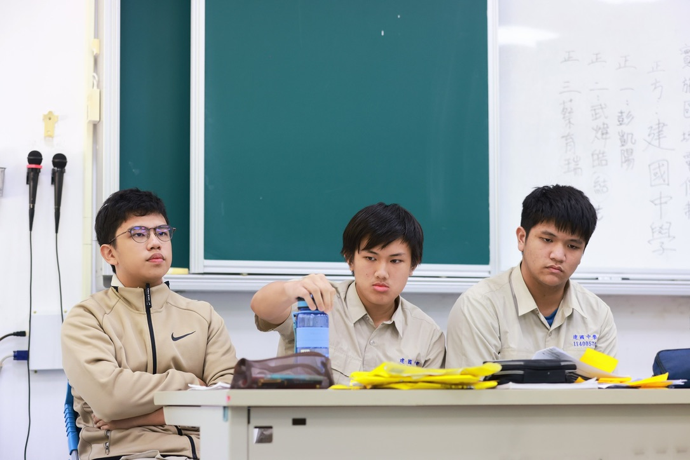

# 講演社在做什麼？
講演社的主要工作是辯論，我們會到台灣各地的高中或大學參加辯論比賽。在參加辯論比賽的過程中，可以對於社會議題有更深刻的認識，也能訓練能言善道，說服他人的能力。🗣️

# 為什麼你該加入講演社
講演社有許多活動可以參加，如果你喜歡和其他學校的同學交流，我們有建北附松四校的新生盃、迎新和春遊，都是認識好朋友的機會。我們也是歷史悠久的社團，每年會定期舉辦學長大會，如果你想認識厲害的學長，也可以加入講演社。🦖

# 講演社打比賽都是怎麼進行的?
我們在打比賽前會討論論點，查找比賽要用的資料，也會和友社（全台灣）打練習賽。我們會在比賽前一天晚上前往比賽場地附近的旅館進行賽前夜，每一次比賽都是難忘的回憶！🔥

# 講演社平常有什麼活動？
講演社除了平常的打比賽以外，也有聯新盃、迎新、春遊、學長大會等活動

# 如果我沒有打辯論的基礎可以參加嗎？
當然可以！我們這裡絕大多數的學長都沒有打過辯論，只要有一顆積極的心，都可以變的很厲害！❤️

# 學長會很嚴肅嗎？社團有學長學弟制嗎？
這裡的學長都很幽默有趣，平常也會和學弟一起玩桌遊。
我們沒有學長學弟制，只有學長學帝雉！🦚

學弟和學長一起打比賽⬆️
# 辯論比賽通常會有什麼題目
例如：
「我國普通刑法應廢除死刑」
「當好人/壞人哪個比較難」
很適合喜歡探討公共議題和思辨的你！🐺

# 如果我不想要參加任何比賽可以加入講演社嗎？
當然可以！我們除了比賽之外，社課也會安排活動，例如：辯論影片欣賞、社會學分享等，或者你是想要有一個溫馨的社辦玩桌遊，那有「南海路桌遊店」別稱的講演社，絕對是最適合你的地方！🃏

有更多問題歡迎私訊我們的IG，或使用以下匿名連結～
https://ngl.link/ckhsdebate1?fbclid=IwY2xjawTF2hRleHRuA2FlbQIxMQBzcnRjBmFwcF9pZAEwAAEeGSrCXSaBvW9lMm-rgYK0hNXOZE7sWZXy-VTXHBMufg2ndhaI1FSqL2IDNiY_aem_i-4uAnqJo6EYqvD2wVHcYg
