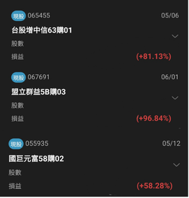

# 投資社在幹嘛？
高中最大的優勢就是「時間」，現在開始累積理財與商業思維，試錯的容錯率高，能讓你輕鬆享受複利的果實！建中投資理財社 22 屆（CKIFC）主要透過實戰導向的課程，帶領大家理解市場如何運作，建立不只看股價漲跌的商業思維。沒有基礎也完全沒關係，我們的知識都是從零開始建立，並且會依照社員程度與需求來規劃課程，確保每位社員都能收穫滿滿。

# 實戰導向的三大派別
我們的課程由三位不同風格的學長親自授課，分享他們自身的實際投資經驗，絕對不照本宣科（並非模擬交易）。投資組合與策略有三個派別，市場上沒有標準答案，但你可以在這裡找到屬於自己的答案：
 * **廖陞融學長（技術分析 × 權證交易）**：帶你了解基礎技術分析、衍生性金融商品以及進階交易策略。
 * **簡廷叡學長（美股 × 總體經濟）**：從國際政治與總體經濟的角度理解市場，涵蓋科技產業、全球經濟與美股分析教學。
 * **林于閎學長（產業研究 × 價值投資）**：長期追蹤 AI 產業與科技技術，教你從基本面尋找被市場低估的公司，並提供台股投資教學。

# 豐富的課程與活動
除了日常的長短期投資、總體經濟與自營商交易等課程外，我們還有各式各樣的多元活動！
 * **企業 / 大學參訪**：走出校園，實地了解企業運作與大學資源。
 * **寒暑訓練營 & 投資競賽**：透過營隊與比賽，將所學知識化為實戰經驗。
 * **經驗分享 & 講師演講**：邀請各路高手與講師來和大家交流分享最新的市場動態。
# 串聯全台的友社網絡
我們擁有非常廣大的友社圈，平時會和各校交流互動。我們的友社包含北一女中投資理財社、師大附中金融研究社、台中一中金融理財社、景美女中投資研究社，甚至還有台灣大學金融研習社、中山大學投資交易社等遍布全台的高中與大學社團！歡迎大家加入這個大家庭，一起擴展人脈與視野。

建中投資理財社22th_IG
https://www.instagram.com/ckifc.22th?igsh=MWF1Y3oyb3J5dHlyZA==
