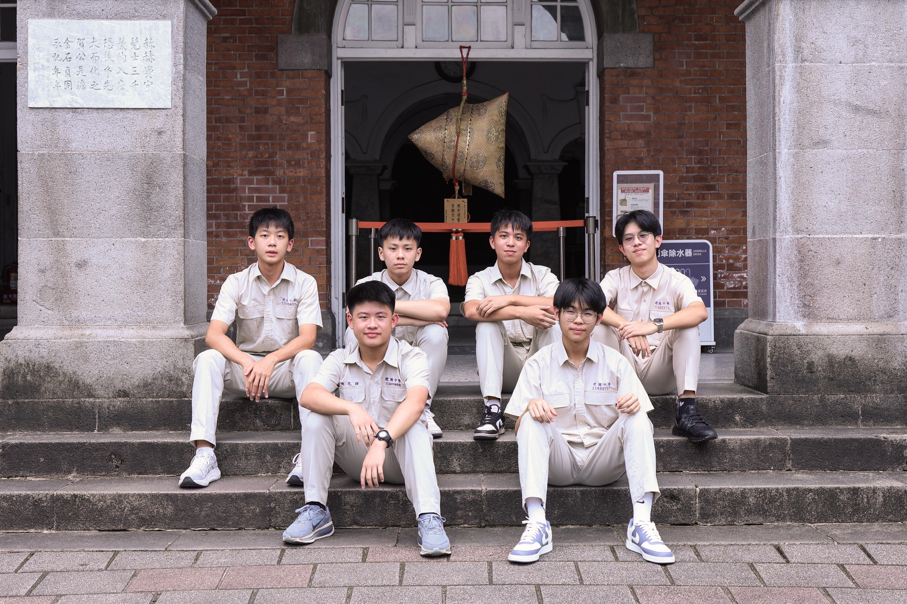
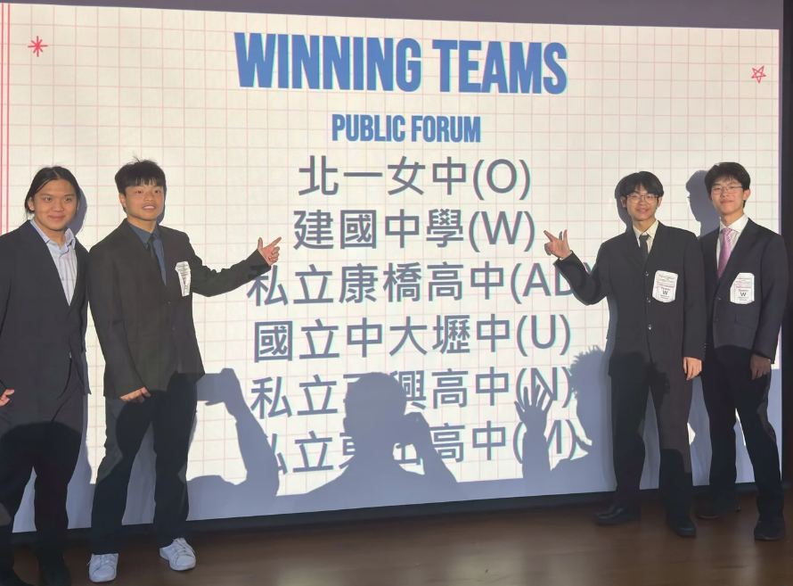
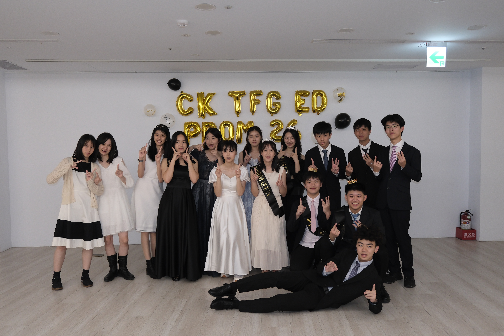

# 英文一定要很強才能加入嗎？
其實英文能力不是最重要的！更重要的是清晰、有條理的思辨能力，以及願意表達、勇於挑戰的心。就算現在英文不夠流利，學長們也會手把手帶著你練習，幫助你適應英語辯論的節奏與方式。持續利用英文思考、練習，不知不覺就會有明顯的進步！

# 之前沒有接觸過辯論，我能跟得上嗎？
如果你對辯論有興趣，甚至已經有不錯的英文能力，那更推薦你加入英辯社！許多學長新進時也都是辯論新手，因此絕對不用擔心自己不夠厲害，我們會從最基礎的邏輯思考開始，帶你認識各種辯論形式、學會寫辯稿，在輕鬆的氣氛中培養口說。

# 會有哪些活動和比賽？會影響課業嗎？
除了社課與比賽，我們還有體驗營、開學後舉辦的迎新、學期中的聯課、舞會等許多活動，是認識新朋友、和友社拉近感情的絕佳機會！比賽方面，除了參加西塞羅與全國賽，我們也會安排多場友誼賽，讓所有社員都能磨練技巧、建立自信。以上活動都是自由參加，所以不僅不會排擠到讀書時間，更能替學習歷程檔案增添亮眼的一頁！

# 有學長學弟制、留幹制嗎？可以地社嗎？
我們完全沒有學長學弟制或留幹制！學長學弟都能像朋友一樣相處。另外，即使高二沒接到幹部，也能繼續在英辯跟大家一起打比賽～
當然可以地社！開學後我們會公布表單，學弟們只要填寫就能加入，一起參加我們舉辦的比賽徵選、論壇或活動！

# IG：cked_13th
