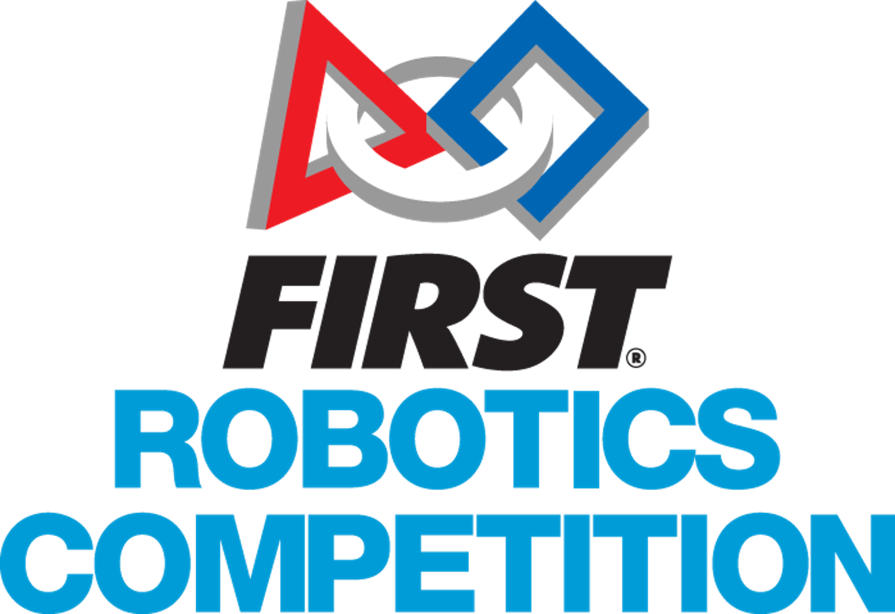
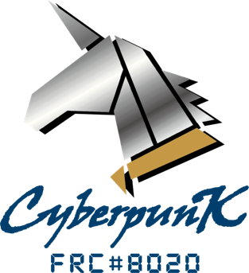
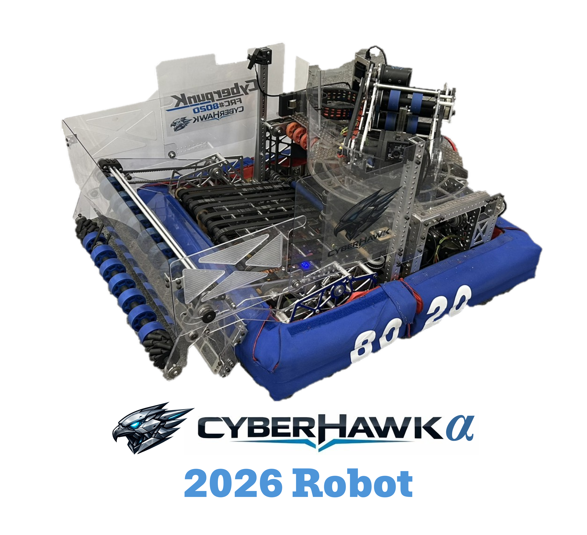

# 建中機器人研究校隊

## 機器人時代正在發生!

**FIRST Robotics Competition (FRC)** 是一個針對全球高中生舉辦的機器人競賽。在短短六週的時間內，學生團隊需要在嚴格的規則與有限的資源下打造出一台工業級機器人。

 - 每年 10萬+ 學生參加
 - 每年約 11.5%  MIT 及 Yale 新生參與過 FRC
 - 40+ 台灣隊伍

## 建中機器人研究校隊引領創新!

建中機研於 2019 年 9 月成立，FRC#8020 是我們的官方隊號，隊名CyberpunK 隱含著建中的縮寫 C.K.，獨角獸穿著代表建中制服的卡其領子，想要傳達建中機研的精神:  C.K.  “Lead the Way”!

## #建中機研招生說明會暨面試
場次 : 
2026 年 7 月 19 日 (日)  11:00-18:00  7/18 20:00 前截止報名
2026 年 ~~7 月 25 日~~ 8 月 1 日 (六)  11:00-18:00  7/~~24~~31 20:00 前截止報名
2026 年 8 月 22 日 (六)  11:00-18:00 8/21 20:00 前截止報名

流程:  11:00 ~ 12:00 建中機研招生說明會 12:00 ~ 18:00 分組面試

[建中機研校隊 2026 ~ 2027 新生報名表](https://reurl.cc/A9EVej)

## 建中機器人研究校隊不僅僅是做機器!

建中機研校隊的訓練從學術應用到科技整合，更包含**創業準備**、**團隊合作**、**解決問題**、**AI應用**和**商業管理**之多元能力，以培養其面對未來世界不同挑戰所需的素養與技能。無論是否喜歡機器，亦無論過去的經驗，我們歡迎各式新生加入我們的團隊，彼此學習，共同進步！

 - 充實高中生活，結交國內外教授及朋友互相交流!
 - 出國參與國際競賽，增長見聞拓展視野。團隊每年安排台、美大學參訪
(如台大、清大、MIT、Harvard、Stanford、UC Berkeley、Rice、Caltech)
 - **備審資料充足**! 學長們皆成功透過學測或特殊選才進入大學!
 - 每屆約 10%~20% 畢業隊員就讀國外大學，包含:  UCL、NUS、UCSD、UCI、Rice、Imperial、UIUC、Purdue、SUNY、NTU、Columbia。

近期 FRC 比賽成果:

2026
 - FIRST Impact Award Central Illinois Regional
 - Excellence in Engineering Award Midwest Regional
 - Excellence in Engineering Award at Houston Championship Milstein Division

2025
 - Excellence in Engineering Award New Taipei City Regional
 - FIRST Impact Award San Diego Regional
 - Houston Championship Milstein Division Rank: 33/75
 
2024
 - Regional Finalist & Excellence  in Engineering Award Long Island Regional

Website: www.ckrobotics.org
Email: ckfrc@gl.ck.tp.edu.tw
Facebook: frc8020
