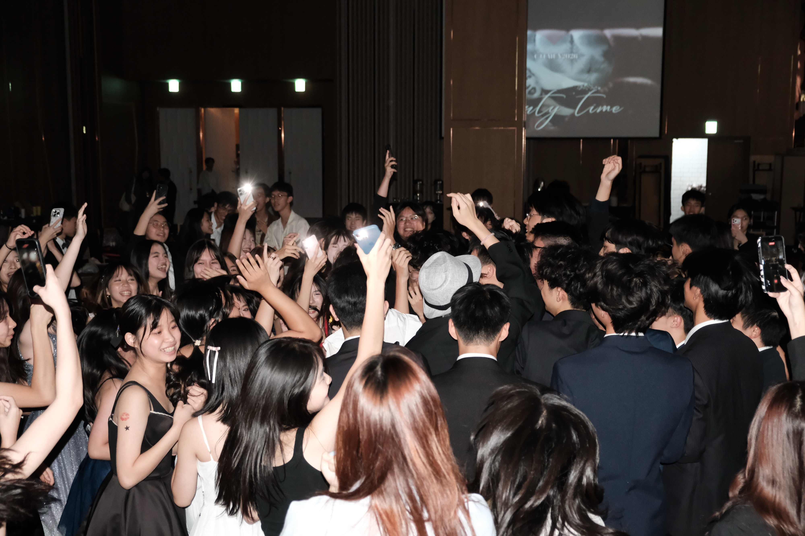
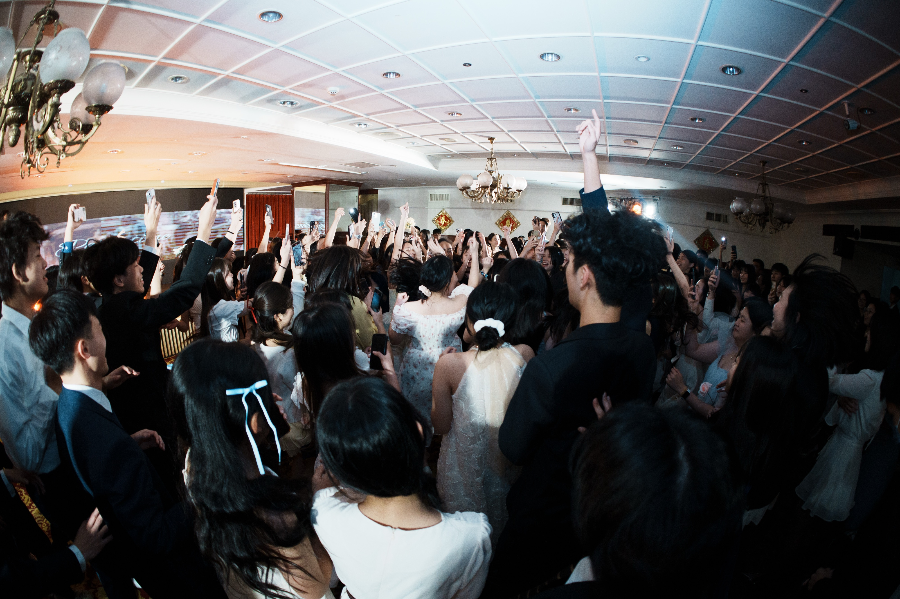
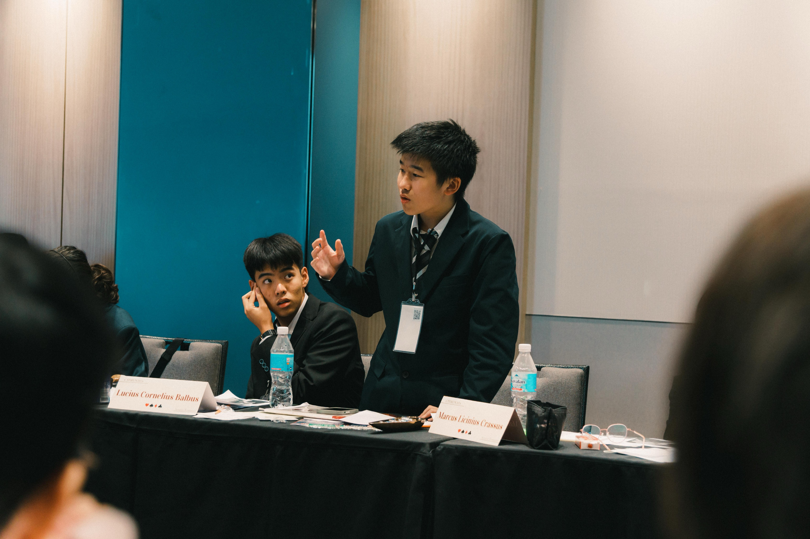
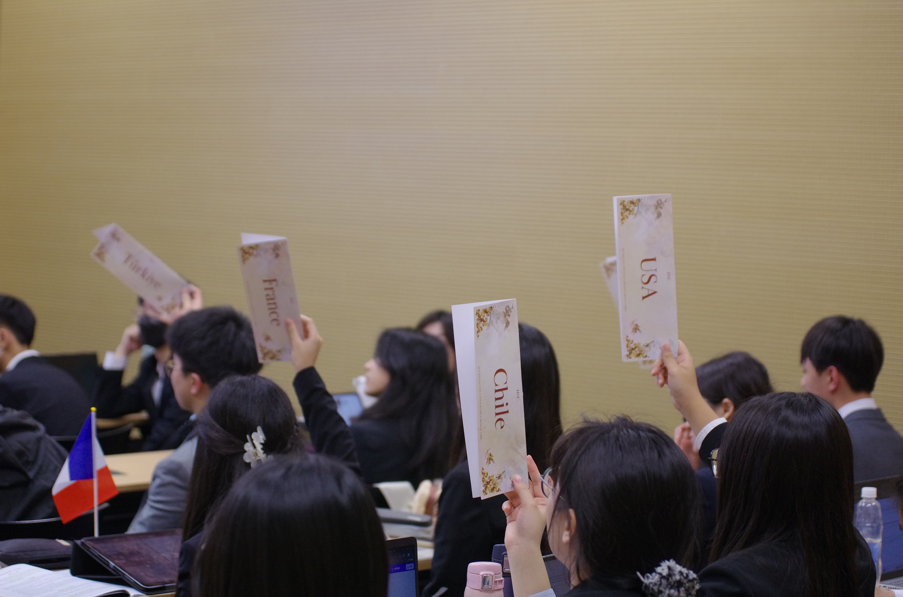
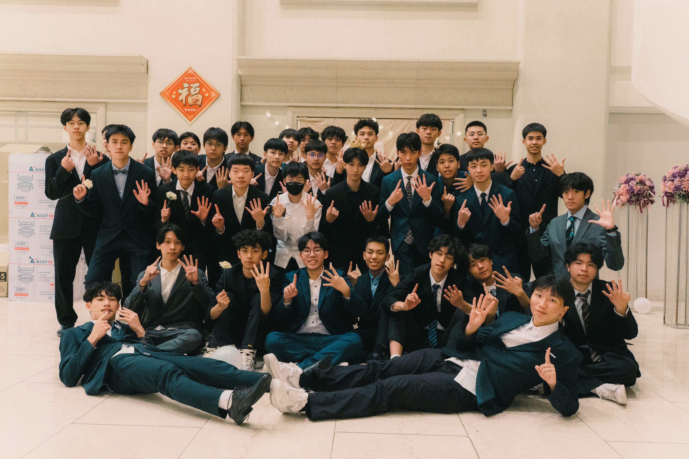

![會議1]

# What is MUN
模擬聯合國（Model United Nations，簡稱 MUN）顧名思義，是一項模擬聯合國會議運作的學術性活動，參與者將扮演各個國家的外交官，針對全球政治、經濟、人權、環境等多元重大議題進行辯論、談判與決議撰寫。在模聯的會議中，代表們需根據所代表國家的立場權衡發言，並在立場堅持與合作妥協之間尋找平衡，達成共識。透過模擬國際組織的運作機制，代表們能深入理解國際關係的複雜性與多元性，並提升公共演説、邏輯思辨、團隊合作與國際視野等關鍵能力。

不過模擬聯合國帶給你的，遠遠不只會議本身的收穫！在這個兼具學術深度與社交溫度的社團中，你將有機會參與美式舞會、體驗社交舞的優雅，享受 Party Time 的熱情，還有精緻的 Buffet 晚宴。除了在議場中激盪思想、磨練表達能力，你也能在會議之餘活動中放鬆交流，與來自各校的菁英們建立深厚的友誼。

![晚宴1]

# 你可以獲得什麼
- 聯合國及國際組織架構
- 基本會議規則
- 公開講演能力
- 資料蒐集
- 辯論技巧
- 流利的口才和穩健的台風
- 更寬廣的國際視野
- 與來自不同背景的人交流的機會
- 精進英文口説寫作
- 漂亮的社團參與學習歷程
- 對國際時事的批判思考能力

![會議2]

# 精彩活動等你參加
八校聯合迎新
由建中、北一、附中、中山、成功、松山、大同和景美一同舉辦，透過一連串有趣的小隊活動和友校同學認識，拓展人脈並爲日後合作打基礎。

建北萬聖節晚會
在萬聖節和北一青議一同舉辦，有一些小遊戲、表演和扮裝派對，體驗第一次的晚會狂歡，並增進與友社的感情。

建中山聖誕節晚會
在聖誕節和中山模聯一起舉辦，用一些小活動和不可缺少的交換禮物，增添耶誕氣氛，加深和友校的情誼。

社交舞聯課
和中山的友社練習晚宴的重要環節，社交舞，有學長學姊教導，讓原本不會跳舞的你也能學會。

聯課
和北一、中山的友社一起，由厲害的學長學姊或資深的Muner授課，讓你更加熟悉模擬聯合國。

寒訓
有建中、北一、松山、大同、景美、政附、中女中、雄中、雄女共同舉辦的盛大會議，不但可以體驗完整的會議還可以和中南部的精英交流。而且期間還可以增進社內的向心力，是個十分有趣又重要的活動。

CTFMUN
是本社與北一青年議會社聯合舉辦的大型正式會議，開放全台高中、大學生參加，年復一年復刻成功經驗，是台灣著名的高品質會議之一。

![晚宴2]

![社團合照]

