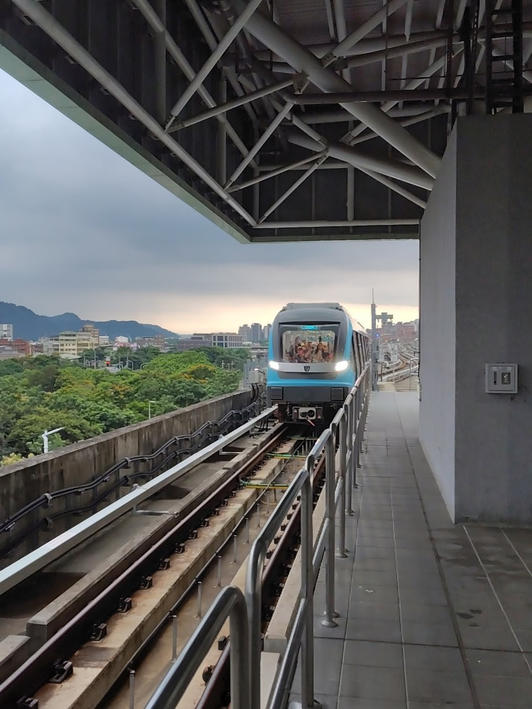

# 地理遠不止你想像的那些
厭倦了課本裡的地理內容嗎？
加入世界地理探索社，一起跳出課本吧！
我們的上課內容除了人文地理外，還涵蓋了街景識別(GeoGuessr)、交通、語言學、地緣政治和歷史等等內容。
無論你是GeoGuessr大師、交通迷、緊跟時事的青公民、歷史電神......，都可以在這裡找到同好一起討論！
# 各種戶外活動
## 城市定向比賽
預計在10~11月舉行
如果你喜歡捷運，或喜歡在城市裡走跳，那這個活動對你再適合不過
我們會搭乘捷運，一同進行各種闖關活動，互相比拼積分
## 環島寒訓
預計在寒假舉行
臺灣人必做的三件事：遊日月潭、爬玉山還有環島！
我們會搭乘臺鐵，遊覽全臺各個縣市<del>（除了南投）</del>，也會有團康小遊戲和大地活動，可以深入的了解各個城鎮
## 捷運機廠參訪
預計在5月舉行
喜歡捷運的人千萬別錯過
我們要一起進入臺北捷運的高運量行控中心還有北投機廠，探索捷運的奧秘
## GeoGuessr 大賽
預計在5~6月舉行
喜歡玩GeoGuessr的人可以一同聚在一起，互相比拼GeoGuessr實力的好機會
贏家還會有獎勵喔！

除此之外，我們還有其他計劃中，例如實地勘查等等的活動！
# 免費的社團資源
喜歡玩GeoGuessr卻苦惱沒錢買Premium？
我們有社團公用的Premium帳號可以使用！

加入我們的[Discord伺服器](https://discord.gg/RXrQecuFyZ)，可以和大家一起討論各種地理內容！
# 友社
我們的友社有附中交通地理探索社、成功世界地理探索社和松山地理探索社
另外在校內也與西洋棋、韓研與象棋社關係很好
~~如果想同時地社門檻很低~~

