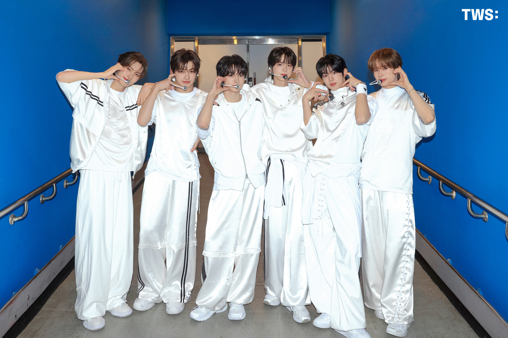
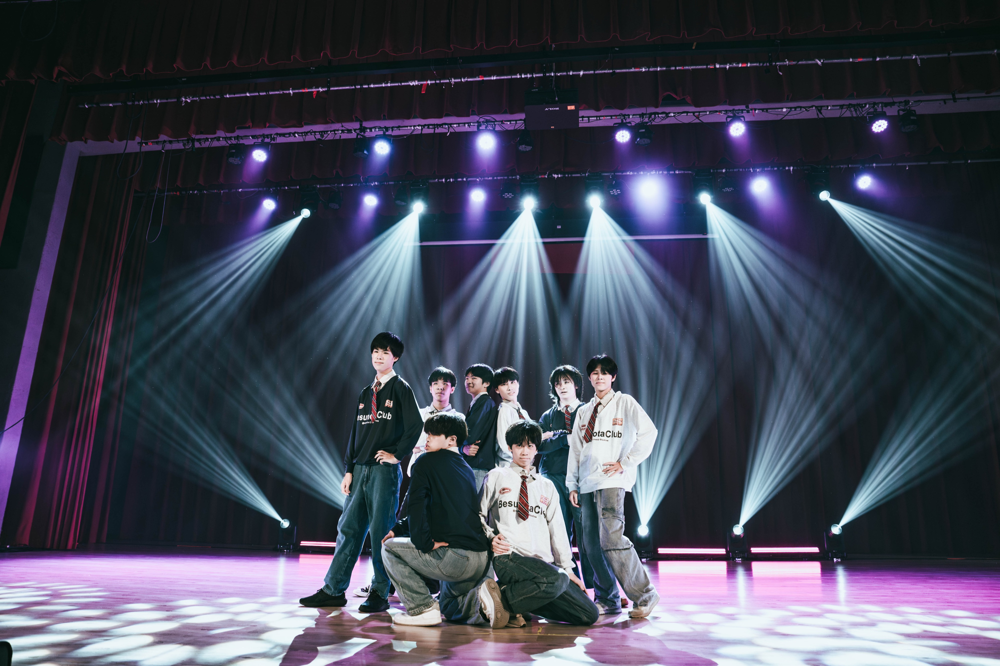
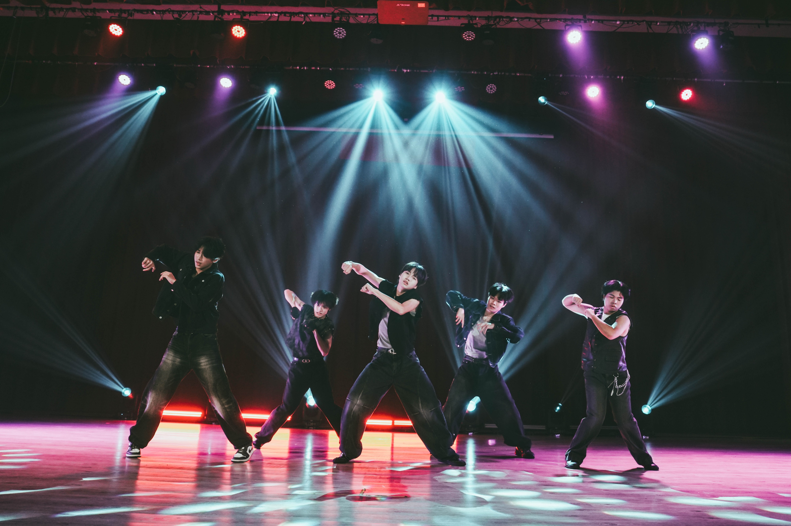
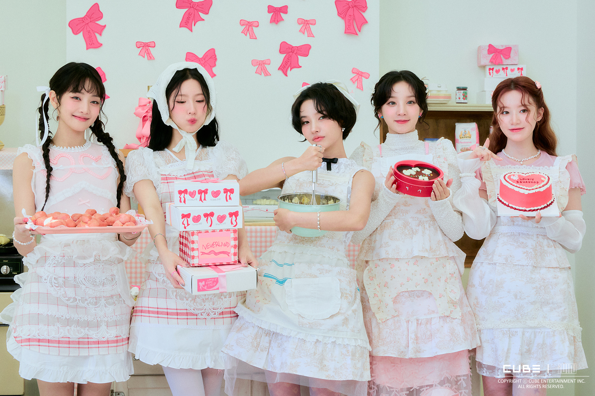

# 韓研社在幹嘛！
我們有**文化課**和**舞課**，平時社課主要上**文化課**，介紹韓國各種文化，從語言、音樂、飲食、美妝到旅遊，通通告訴你！**舞課**則會帶著你從基礎開始上手Kpop舞蹈，對跳舞有興趣的也絕對不能錯過！當然，你想和聊Kpop都可以找學長聊天，學長抽象又搞笑！
下面附上귀여운**TWS**

# 不會跳舞也可以加韓研嗎？
**當然可以呀～**我們跳舞的部分都是選擇性加入的喔，不喜歡跳舞我們不會強迫！如果想要跳舞，在舞台上表現自己，不用擔心！學長們也會從頭開始教學，帶著你跳出自己的風格～

# 練舞會佔用很多時間嗎？
**不會喔～**我們舞課都是在平日**中午的休息時間**，一週1~2次，大約30分鐘左右。表演前則會加強練習，放學和假日也可能需要練習，除此之外蠻彈性的，如果有困難也可以找學長討論喔！

# 韓研有什麼表演機會？
以上一屆來說，我們有被邀請到各校舞會（建中、中山、新莊、大同等）、社團聯展、HKA聯展、獨立大成…的經驗，絕對有很多機會可以上台表演、享受舞台，很期待你們的加入！

# 有哪一些好玩的活動？
我們有很多精彩的活動喔～我們在開學後會有一個**八校迎新活動**，透過一連串有趣的小隊活動和友校同學認識，一起享受韓國文化，接著也會有**秋遊**、**聯展**、**寒遊**，甚至是在信義商圈的大聯展—**HKA**，等著學弟們一起來玩～
最後附上예쁜**i-dle**

아 맞다！對韓研有興趣或還有疑問的親古，都可以去我們IG追蹤**正副社長**或**公活**聊天問問唷！
[建中韓研3rd_IG](https://www.instagram.com/ckkc_3rd)
