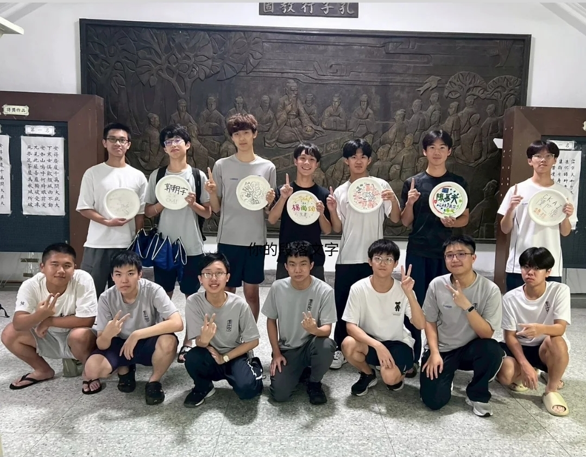

# 人工智慧研究社是什麼？
人工智慧研究社，簡稱AI社，顧名思義就是研究AI的社團，除了課程以外也常會和其他資訊類社團合作辦活動，不需要任何基礎，我們都歡迎你的加入！💪

# 學習內容

社課：周五第五節社課會教實用的AI工具，像是語言模型的進階使用方法，讓你比之前更會使用AI，也會教一些些程式設計，像是最實用的Python，我們會從零開始教，零基礎也沒有關係，我們會慢慢帶你了解。

小社課：每週三16：20到17：30會教AI基礎理論，帶你了解AI運作邏輯，是怎麼訓練的？，怎麼思考的？像是大家常聽到的機器學習，強化學習，深度學習都在我們的教學範圍內。

實戰演練：透過所學工具做出專案，像是假設網站，或做出App解決問題，小社課我們會自己訓練AI模型，像是圖像辨識，自動分類。

成果發表：會舉辦社團成果發表，讓大家看到我們的學習成果。

交流合作：定期與友社（如建中電研、資訊、中山資研等）舉辦活動。像是迎新，茶會等。

# 社團特色

我們沒有學長學弟制，正地社也都一視同仁，就是一群對AI有興趣的人一起討論研究，我們社團也有很多的學習資源，像是學長編的講義，並且我們不收社費，歡迎所有人加入人工智慧研究社！👍

# 加入我們
如果你喜歡創新，想加入這最前沿的研究領域，那就請加入人工智慧研究研究社，跟我們一起學習吧!🔥

