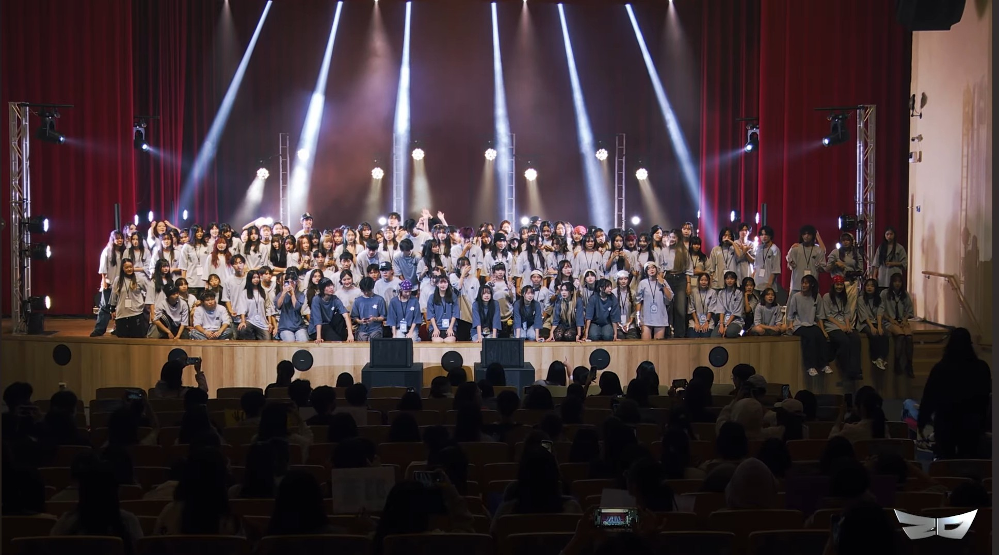
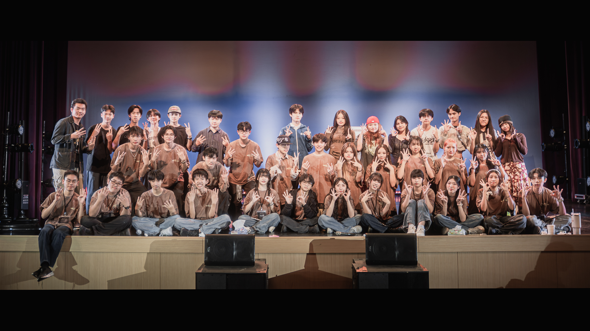

# 熱舞社在做什麼?
主要是在學習各種舞風並找到最適合自己的類型，如:Popping, Locking等。學長們會先帶你們做基礎，再讓你們體驗各種舞風，最後讓你們自由選擇一種舞風作為日後主要的練習方向。在練習之外，我們也會帶你們參加許多活動，讓你們可以增廣見識，有時也會請老師來讓你們學習更多進階的技術。而且不管你有沒有跳舞的基礎，我們都熱烈歡迎你的到來，就像學長們也是從零基礎一步步跳到現在這個樣子，完全可以放心的加入。

# 社課
社團課程的時間會在每個禮拜五的下午第一節課，地點在司令台。主要會帶你們練習自己所選舞風的基礎和動作，有時候也會進行社內的battle，可以盡情的發揮自己所學的東西，練習過程也不會讓你們有太大的壓力，之後的練習也會認識到很多外校的朋友，能夠一起練習並進步

# 活動
在剛開學的時候我們會舉辦八校聯合迎新舞會，讓你們對各舞風有認識，接著是20聯，由20所學校共同舉辦，可以欣賞到各校的表演及職團的演出，下學期的成發也有表演機會，能夠讓你們在舞台上盡情地綻放光芒、發光發熱。此外之後也會有很多小型的battle，在展示自己的舞蹈技巧的同時也能認識很多外校的朋友，一起跳舞一起進步。

這是我們的IG，歡迎有興趣的來追蹤
[建中熱舞34th_IG](https://www.instagram.com/_ckdc_?igsh=MXRjc3Y2eHAzYWZtZA==)
