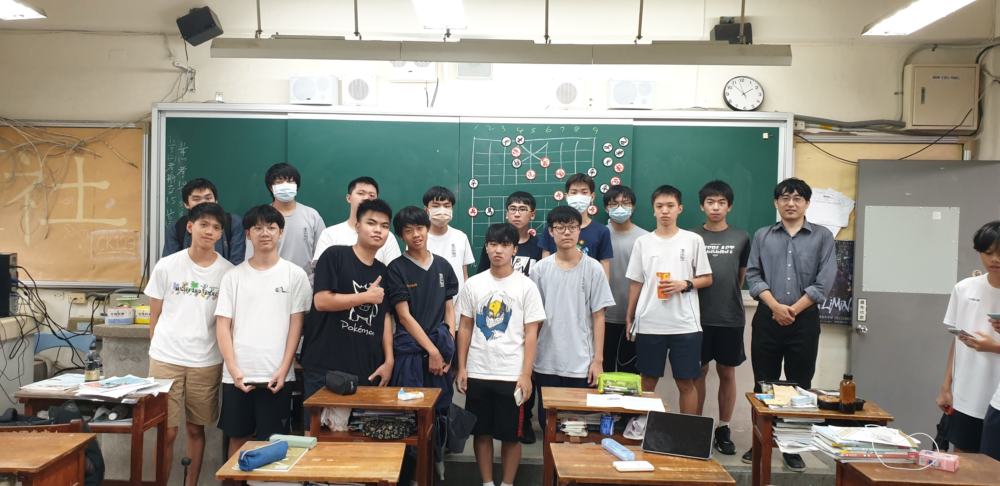
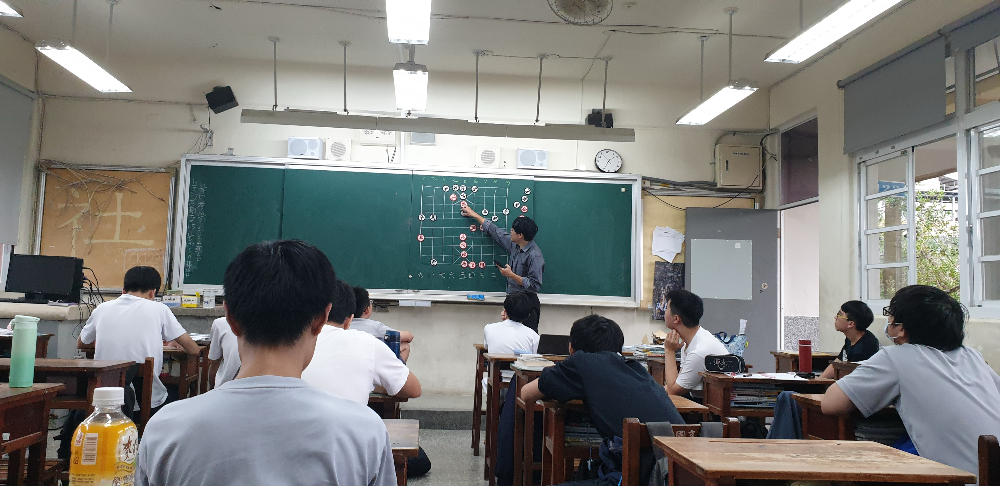

# 象棋社在做什麼?
象棋社每週一次的社團課，是主要的活動形式。課程分為兩種：由老師講解棋局與戰術的教學課，以及社員間切磋的自由對弈。沒有額外的小社課安排，但每次社課內容充實，不論是初學者還是已有基礎者，都能在其中獲得提升與樂趣。

# 老師教學
本社團教學內容包含象棋棋局講解、經典難題解析及比賽實戰拆解，幫助社員深入理解棋理與戰術運用。老師會循序漸進地帶領大家掌握布局、中盤與殘局技巧，提升實戰應對能力與思維邏輯，是培養專注力與策略思維的絕佳課程。

# 自由對弈
自由對弈時，社員可自行安排對局，社團備有棋盤與棋子，方便即時切磋。這不僅提升棋藝，也避免平時找不到對手的困擾。若當日不想下棋，老師通常會在黑板留下殘局，社員亦可觀察並思考解法，享受象棋變化中的深度與樂趣。
