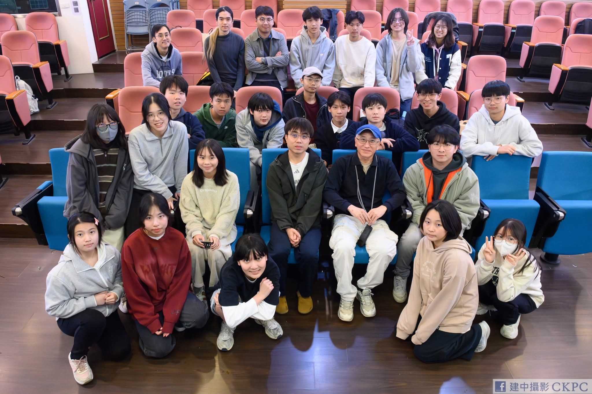
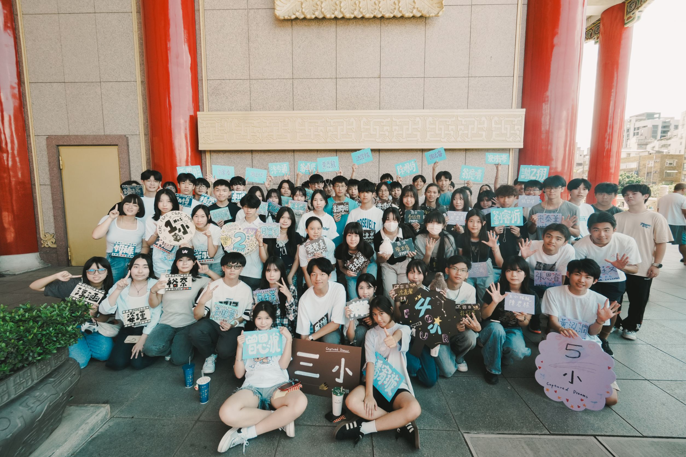
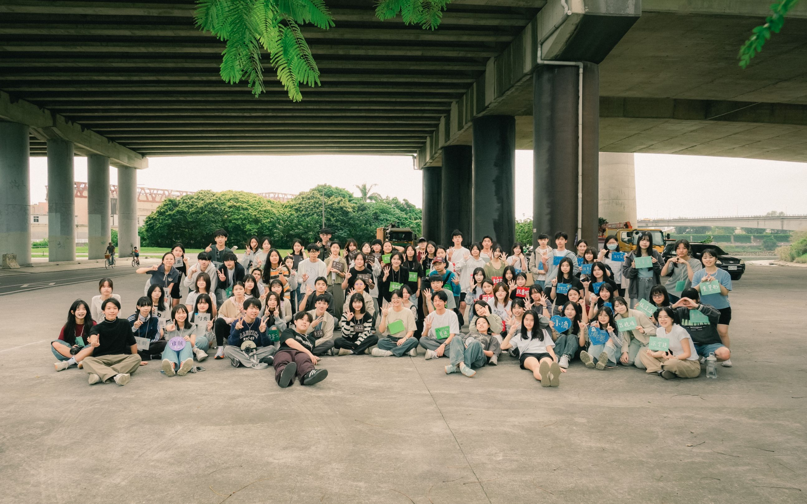
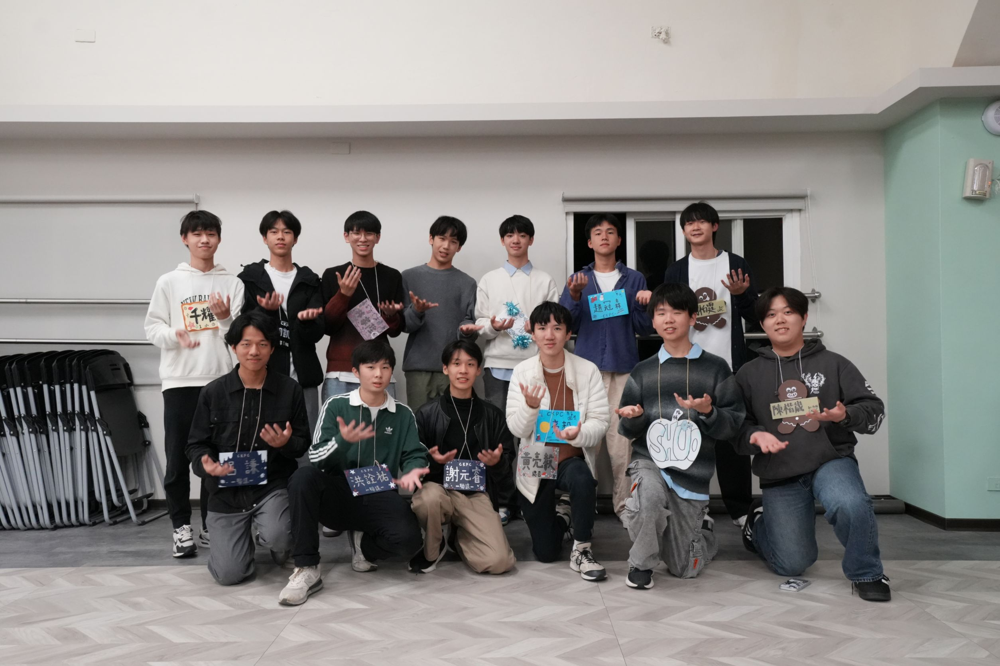
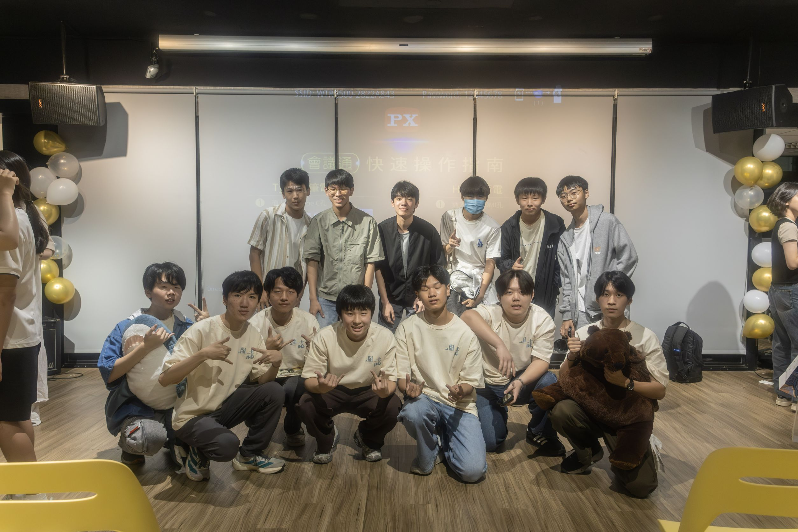

學弟！剛踏入建中的你，是否正在尋找一個既能學到一技之長，又能拓展人脈、與夥伴們一起進步的歸屬？那**「建中攝影社」**絕對是你高中的首選！在這裡，你的高中生活不只多了觀景窗裡的風景，更有豐富的活動讓你認識有相同興趣的好朋友！我們不只教你實用的攝影技巧，更帶你走出校園，結交各校對攝影有興趣的同好。

# 可以學到甚麼？ 
從基礎觀念到進階技巧，有獲得2026全國學生攝影比賽銅獎的學長親自教授攝影知識，我們也會不定期舉辦小社課以及專業講師講座，讓對攝影有興趣的人學習拍攝技術，並透過活動累積拍攝經驗。

# 想嘗試攝影卻沒有相機嗎？
沒有器材也沒關係！我們有和相機廠商合作的**「社機」**，只要登記就可以把它借回家，讓你可以透過實際操作學習！

# 有基礎但想更精進？
那你更應該加入建中攝影！在這裡，我們有畢業學長創立的建中攝影協會**「ckpc.tw」**提供更專業的訓練與高階器材，甚至有實習的機會，讓想更進一步學習的人提升攝影技巧！

# 有甚麼活動？
這學年的活動超級精彩。從小迎、大迎，到秋烤、聖晚、春遊、寒訓以及暑訓等等。這些活動會帶你走出校園，結交各校熱愛攝影的夥伴與同學。

# 會有拍攝機會嗎？
會有拍攝機會嗎？當然有！近期校園活動日益多元，需要攝影紀錄的機會也大大增加！你將擁有豐富的接拍與實戰機會，無論是表演攝影或是人像攝影，都能讓你精進自己的攝影技術，每一次活動拍攝都是你的成長機會，甚至可以將相關的經驗放入學習歷程，讓你的學習歷程檔案比別人更加亮眼！

# 想要自己的作品被看見嗎？
每年我們都會和友校合辦攝影展。高一高二社員都能投稿參展。這學年我們將會與**北一攝影社**合辦聯展，把握機會，或許會是你此生唯一一次能看見自己的作品在攝影展中展出，是讓大家看見難得的好機會！

# 有其他心儀的社團了嗎？
沒關係，我們有地社可以加入！我們會把每週社課的內容放上雲端，讓地社成員都能跟上進度，與友校舉辦的各個活動也都可以來參加！

更多作品與聯絡資訊看這邊
IG：[ckpc_63rd](https://www.instagram.com/ckpc_63rd)
Email：ckpc63rd@gmail.com
