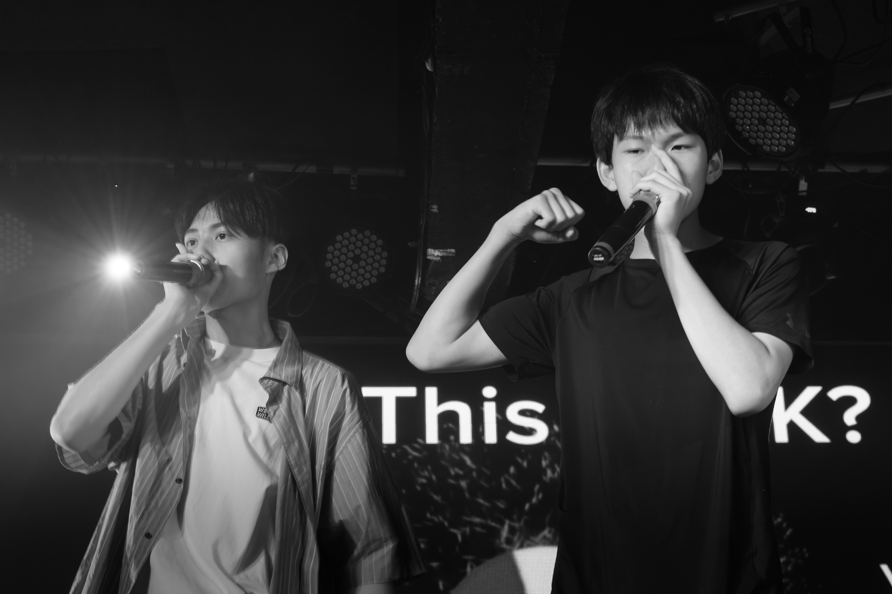
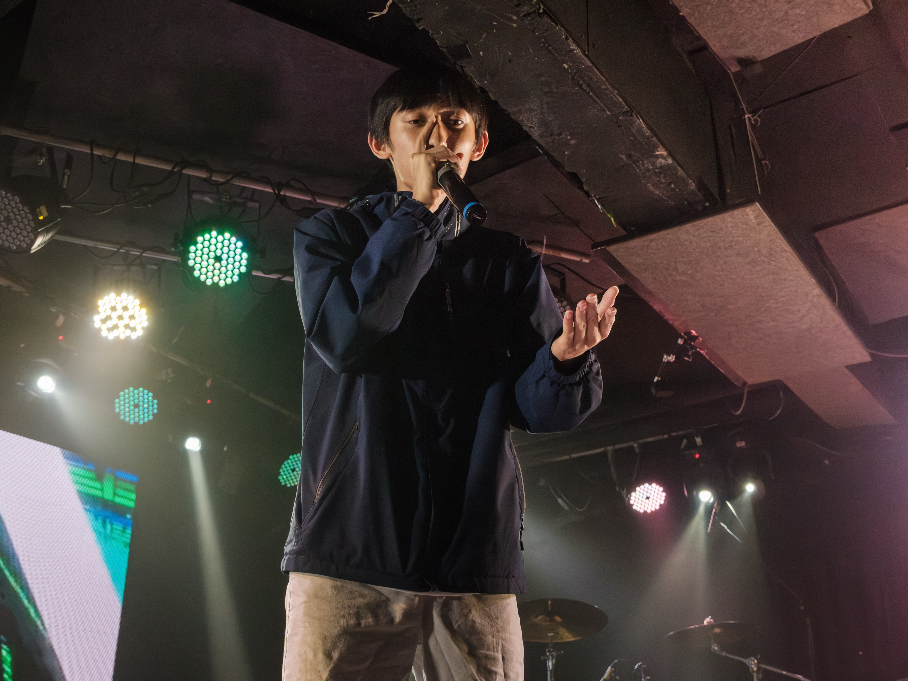
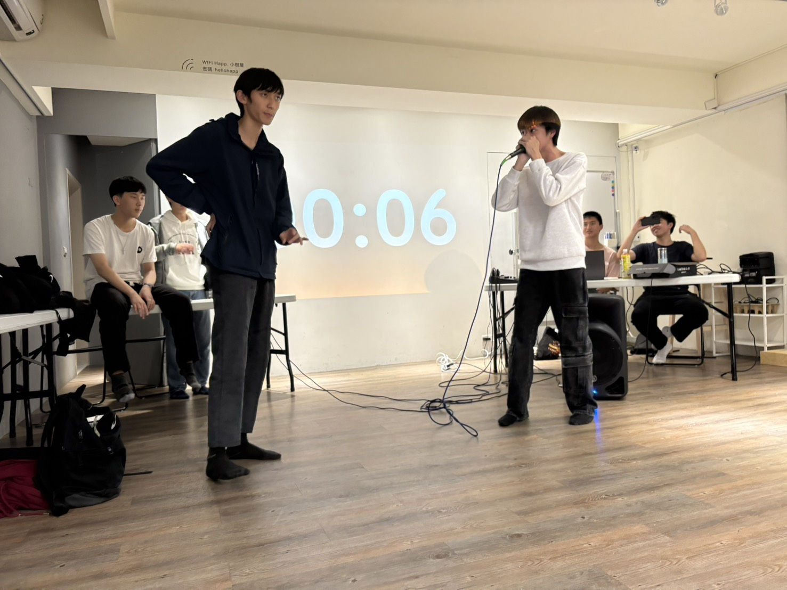

# 口技是什麼？
口技就是Beatbox，只要利用一張嘴就能演奏多變且炫酷的音樂節奏，我們口技研究社致力於推廣口技文化，讓口技被大眾看見。
無論你是新手還是已有基礎，建中口技都歡迎你的加入！

# 學習內容
基礎教學：從簡單的 B、T、K 開始再到後面各種酷炫bass及特殊音，帶你從頭認識 Beatbox 各種技巧。
實戰演練：定期驗段子、舉辦Battle切磋實力，讓大家實際運用所學。
成果發表：參與校內外表演活動，如舞會、社團聯展、大成等，展現我們的聲音魅力！
交流合作：定期與友社（如中山阿卡、成功口技、建北流音等）聯合練習與演出。

# 社團特色
🎤 不用樂器，只用一張嘴，隨時隨地都能玩出節奏與風格
🗣️不耽誤課業，大家能自由運用時間，隨時隨地想練就練！
🔥 社團氣氛自由、活力四射，人人都有機會上台表演！

# 加入我們
如果你熱愛音樂、喜歡創新、想挑戰聲音的極限，不想去無聊的學術性社團，想隨時隨地炸爛你的朋友，成為西格碼🗿🔥🔥🔥🔥
那就別猶豫，加入口技研究社，跟我們一起「用嘴巴炸翻全場」!

