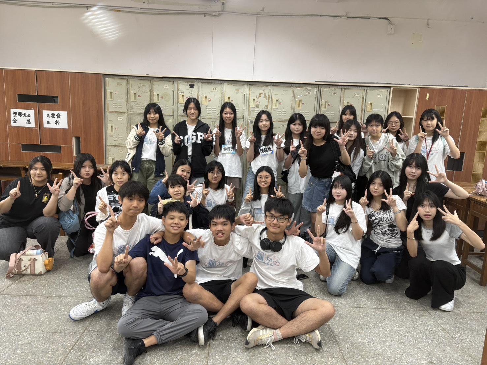
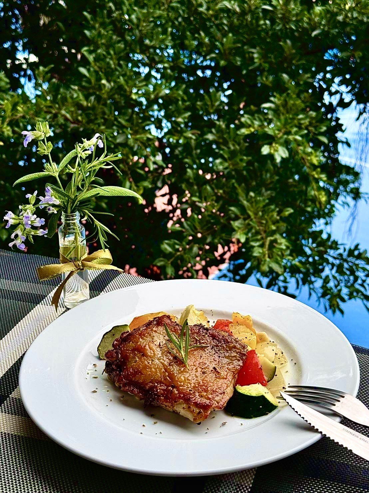
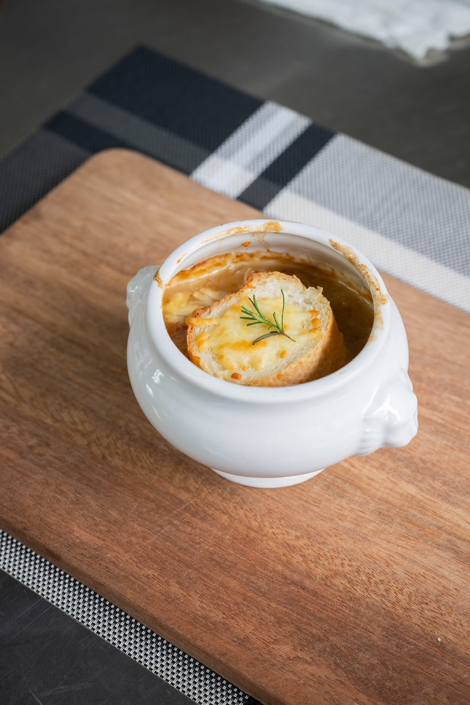

# 美食社在幹嘛?
美食社的主要活動內容是周五的社課，社課時會由學長帶領學弟們進行料理的學習活動。透過每週一次的社課來學習各式的料理技巧，也多多認識不同班的朋友。除此之外我們也有豐富的活動可以與友社的同學們好好交流。

# 友社
我們擁有許多熱情的友社，如北一點心、中山點心、景美御膳等，也經常合作進行活動。
絕對有機會認識女生，解鎖戀愛學分

沒有成功高中 沒有成功高中 沒有成功高中

# 活動
聯課、迎新、秋烤、寒訓、送舊等(去年共八次，過夜活動兩次) 不怕沒事做，只怕你不來!!!

# 社課
每周五的社團課，教學的學長以及老師會準備各種食譜(上屆有牛肉麵、三杯雞、迷迭香雞排、布朗尼蛋糕等)，讓各位在學習之餘能製作並品嘗各種美食

# Q&A
Q:有學長學弟制或留幹制嗎?
A:絕對沒有，有的話社長請全社吃饗食天堂

Q:不會煮飯能加入嗎?
A:當然可以，會洗碗就好。社課後還是會有東西吃!!

Q:給學弟的建議
A:不要吃林乾 不要吃林乾 不要吃林乾

# 相關連結
IG: https://www.instagram.com/ckdc_27?igsh=Mml6Mml5YXh3czRk

ps
社長大大

