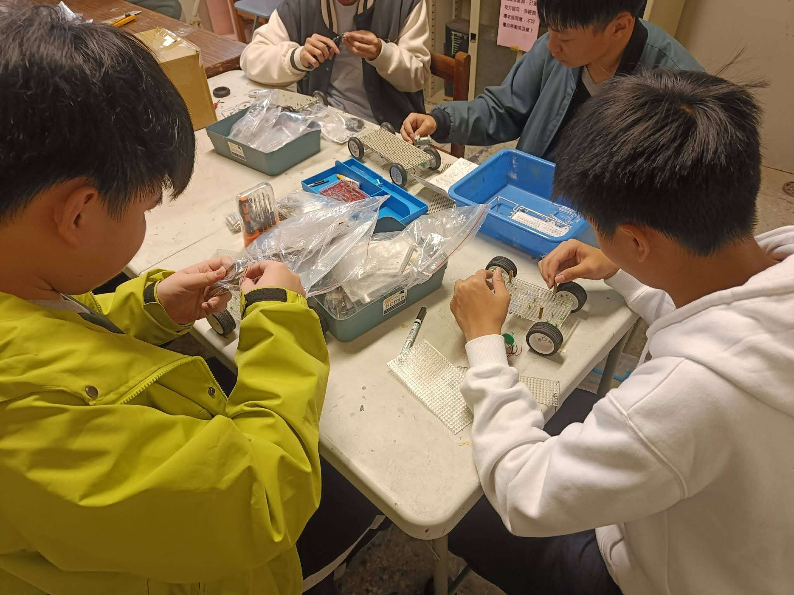
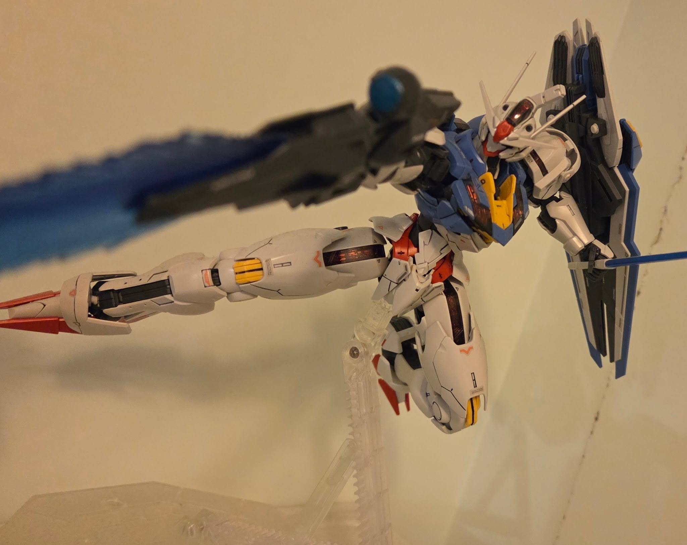
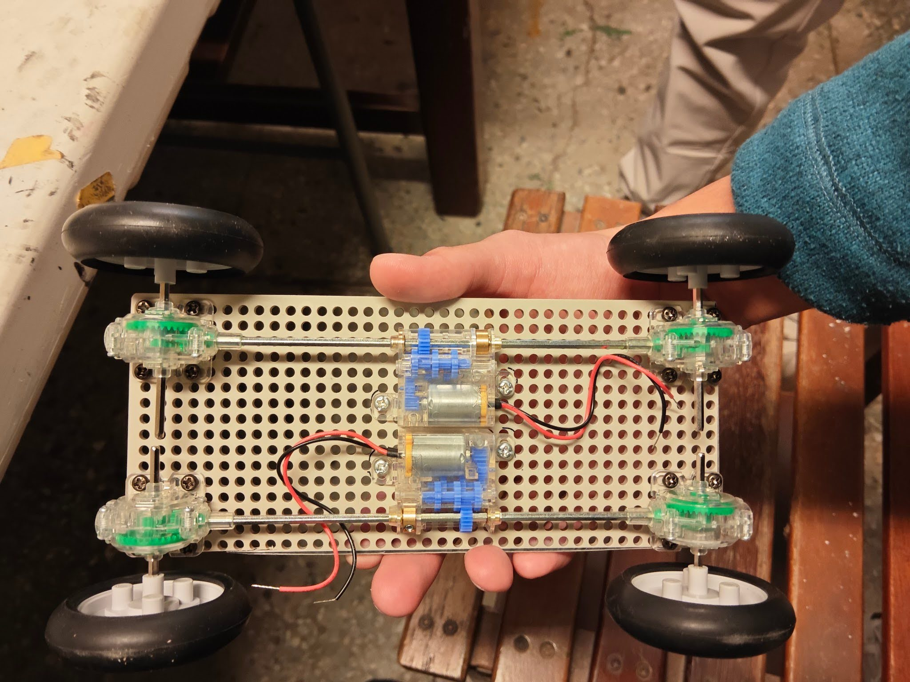

# 模型與社團簡介
　　模型的種類五花八門，有軍事、科幻、交通工具等等，每一件模型都有其獨特之處。假組、上色、噴漆、組裝……經歷整個製作過程，付出心血過後，完成時的成就感足以讓人一再回味。
　　除了得到滿足以外，製作模型也能加強耐心、專注力、空間感、手部操作等方面的能力，對自我提升也有一定程度的幫助。
　　我們社團以模型製作為主軸，同時也有機電整合的部分，提供完整的模型製作教學。目前社團規模很小，上課的氣氛大多很輕鬆，就算沒有很大的熱忱也沒關係，只要每周五學校的社課有到場做東西就好。

　　
# 課程介紹
　　除了學校的社課以外，假日時我們也有可自由參加的聯合社課，由指導老師和大學長們開設，提供更完善的教學。寒、暑假也有課程可自由參加。
　　就算完全沒有製作模型的經驗也沒關係。對於一年級的新生，我們有機電整合的課程，以及基本的模型組合、上色的教學。二年級時會有更進階的課程。經過這些教學，相信能讓社員們完整製作出自己的模型。

