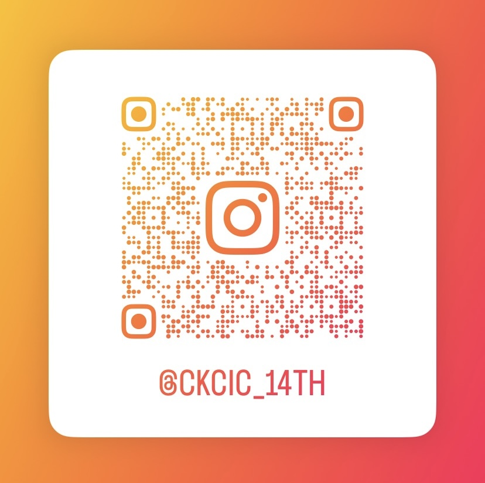

# 關於建漫
喜歡二次元、動漫、電玩的同好們聚集在一起
對創作有興趣或是有喜歡的畫師？
反正也沒有壓力w畫畫是輕鬆的（不畫也沒差？
不會畫畫也沒關係，也可以一起討論二次元話題～
會畫畫的大佬（羨慕）我們有各種創作器具跟資源都可以自由使用～ 還有把您作品製成商品的經費噢
會拿去參加FF或Cwt～

# 社課小社課（秘·密·教·學）
一起討論繪畫技法、欣賞大佬的圖片、研究各種跟二次元文化有關的東西～（或聽社長夾私料）

# 活動（史詩級表演與神聖coser）（喂）
迎新：和他校一起辦迎新活動，和他校同好交朋友（脫   單（X）的好機會～
春遊（寒訓）：請繪師來分享他們的個人經驗，以及和他校一起玩
大成：看表演（你也可以上去）、看神聖的coser學姐（蛤）、擺攤賣自己作品變成的商品ououo
漫展：參加FF/Cwt擺攤！對！擺攤喔～讓自己的作品擁有更好視野的絕佳機會（前提是要抽到就是了，應該抽得到吧）

# 學長學弟制？畫技實力說話？
蛤不道啊我們不就是一起萌混的嗎kekw

更多問題都能找社長跟社帳（對同一個人w
社帳哀居：@ckcic_14th
（https://www.instagram.com/ckcic_14th?igsh=cTdvejU1djYwbmxn&utm_source=qr）
社長：@gluewhite_12gw

