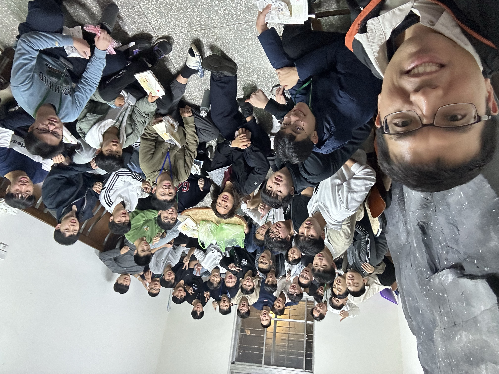
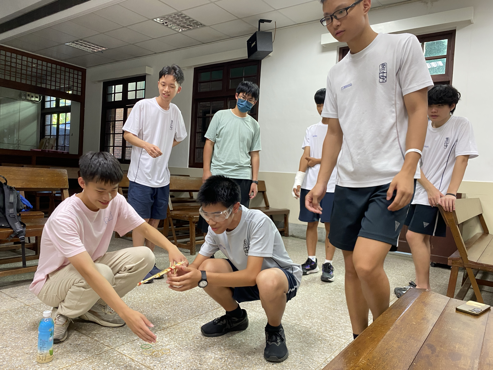
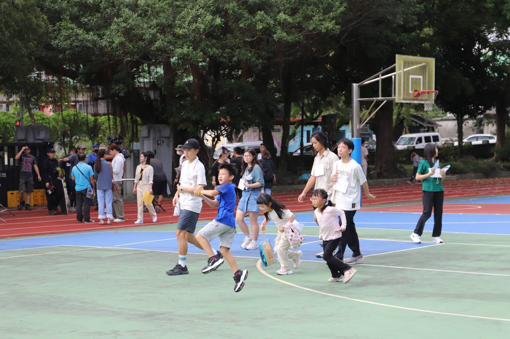

# 青春不留白，只要信望愛
相信各位學弟剛進入建中應該非常的興奮，
但卻又帶著一些迷茫吧？不論對於課業或是人際關係，
但學弟不要怕，看到這裡，代表你的生命要被改變了！

信望愛社是一個零社費、絕對沒有學長學弟制的社團，
也是建中裡面一個溫暖又快樂的大家庭，
相信你只要來過一次我們的聚會，你就能理解到
「每一個來到信望愛社的學弟都是寶」。

無論你在課業上有壓力、想找個一起打球的隊友、
打荒野沒人揪、或是有心事想要找人暢談，
都歡迎加入我們社團，或是在每周的聚會來找我們!
除了同屆的同學和高二、高三的學長們，
信望愛社的畢業大學學長也都會回來參加聚會陪伴大家~

# 在愛中彼此陪伴成長
信望愛社/建中團契 比起具體的「成果產出」
我們更在乎的是在各種活動中，我們心裡的成長
以及彼此扶持的友愛，還有服務、捨己的熱忱。
在這裡少了競爭和勾心鬥角，沒有命令和壓力
多了彼此關心、包容、分享，像一家人一樣的溫暖。

# 大聚會（團契）
固定每周一在正門右前方基督徒聚會處舉行，每周的團契都會有不同的主題，有時候會做吃的東西，有時候會一起玩奇怪的團體遊戲，有時候會有溫暖的專題分享講座，每次主題結束後也都會有自由的近況分享、吃零食、吃晚餐的時間。這裡也常會提供免費的點心，第一次來參加跟我們去吃晚餐的時候，團契還會請客!!!

# 小學服務隊
一學期一次，注重服務的熱情和捨己的友愛。會和北一傳愛社聯合至外縣市國小入駐三天兩夜，舉辦兩天的特色營隊，陪伴國小生培養良好品德。除了營隊本身各校也會準備各自和聯合的活動，讓大家彼此認識，增進情誼。

# 社團課
社團每周五下午第一節上課，透過選社加入。我們每學期會圍繞一個核心主題，錄製不同類型的短影音提供給馬偕兒童醫院，像是「聖誕陪伴」「壓力情緒」等等，涵蓋青少年健康議題、節慶祝福、兒童知識等不同面向，希望能透過我們的影片協助醫院的青少年健康議題。

# 退休會&特殊活動
我們會在一些節日或是連假舉辦到外面過夜的退休會，有可能在學長家，也有可能在公館的校園書房，也會有和其他學校的特殊聚會，像是跟北一團契的聖誕聚會、跟成功團契的桌球荒野對決等等。在寒假暑假也會不定期的參加校園福音團契舉辦或是我們私揪的出遊、營隊等等~豐富你的生活!

# Q:你們和基督教有關係嗎?
A: 我們的名字是「信望愛社」，確實是源自基督信仰的背景，不過我們聚會的內容很生活化，除了信仰相關的內容，更多的是聊天、玩遊戲、吃點心、分享生活、彼此陪伴。如果你只是想找個溫暖、輕鬆、開心的地方，也完全歡迎你來！

所有活動和聚會都不用為正社成員就可參加
歡迎每周一來參加我們的聚會讓我們認識你!
要參加聚會可以先私訊，我們派人帶你去!

這是我們的聯絡資訊
[建中信望愛80th_IG](https://www.instagram.com/ckfhl_80th/)
[建中信望愛官方line帳號](https://lin.ee/v2EJveyG)
[社長IG](https://www.instagram.com/ck_temujin/)
