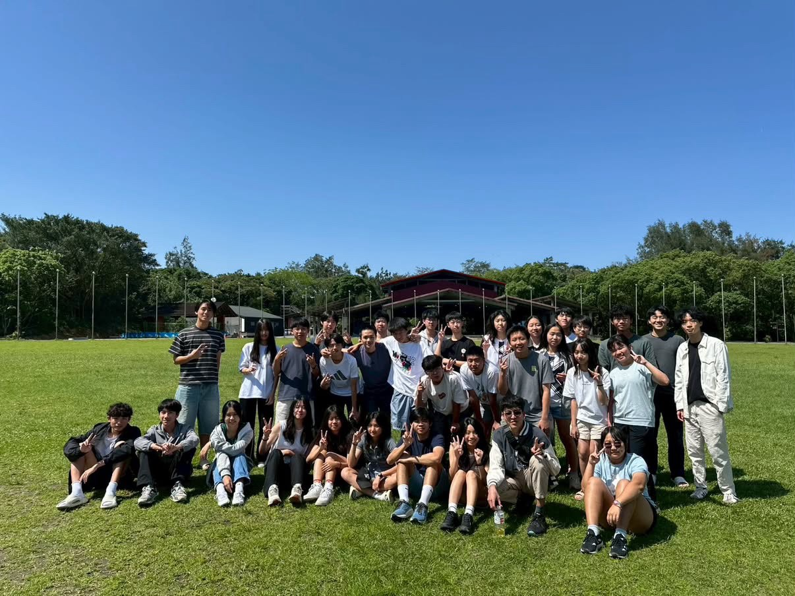
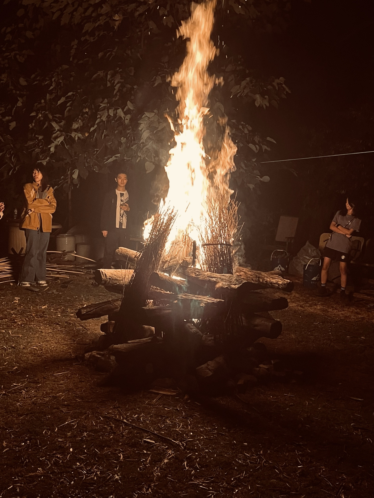

# 戶探在幹嘛？
戶外探索社（簡稱戶探）的日常社課，除了傳授基本的野外生存技巧，更會教大家如何從無到有、籌辦出一場令人難忘的精彩活動。此外，我們每個月都規劃了一次活動來增進大家的情誼，正社、地社皆可自由參加，活動都是在周末，完全不會因此影響課業!!!

# 生命共同體：北一戶外探索社
我們幾乎所有活動都會和我們可愛又充滿知性的北一友社合辦，之後的活動也會陸續與附中、松山等學校合作。總之，絕對不用擔心認識不到女生呦！

# 進入社團需具備之特質
在這裡，你不需要懂任何高深的學術知識，不需要具備什麼專業技能，更不用有任何童軍經驗。我們唯一的門檻，就是「喜歡出去玩」。如果你也和我們一樣，只想在課業之餘，用最純粹的方式瘋狂玩樂，那就別猶豫了，直接加入我們吧！

# 小社課
我們的「小社課」將於下學期展開，每週進行一至兩次，採自由參加制。課程內容由學長姐親自授課，分享辦活動的籌備與注意事項；學期中會讓你們規劃一次單日活動，並於活動後由學長姐帶領進行檢討，幫助大家熟悉辦活動的流程。

# 真正的零學長學弟制
我們深信平等與友情帶來的向心力，遠比威嚴更能激發熱情。因此，我們致力於落實「零學長學弟制」，由學長姐竭盡所能籌辦各類趣味活動，期盼能帶給社團每一位成員無與倫比的高中生活體驗。

# 露營
我們的活動很多，但「露營」永遠是大家心裡的最愛。露營最迷人的地方，不是你學會了多強的野外技能，而是和身邊的夥伴一起從零開始蓋出今晚的「家」。當大家合力把帳篷搭好、圍在營火旁，在沒有手機干擾的星空下徹夜長談，那些平常不敢說的真心話、大笑與打鬧，都會變成最珍貴的回憶。在這裡，友情不需要刻意經營，一場露營、一堆營火，溫度自然就上來了。

這是我們的社帳https://www.instagram.com/ckvs58th
地社表單docs.google.com/forms/d/e/1FAIpQLSfdvNx6M4P_YxgmEi8uITTWiIrqMGOzt4-1gPQHrpoY1p
