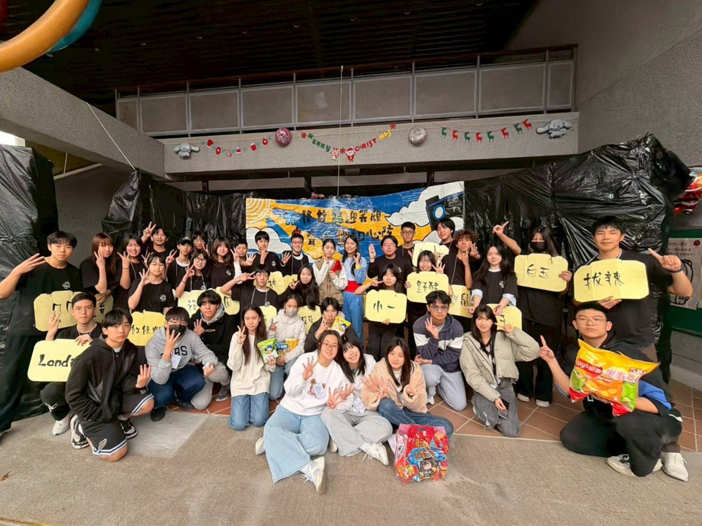
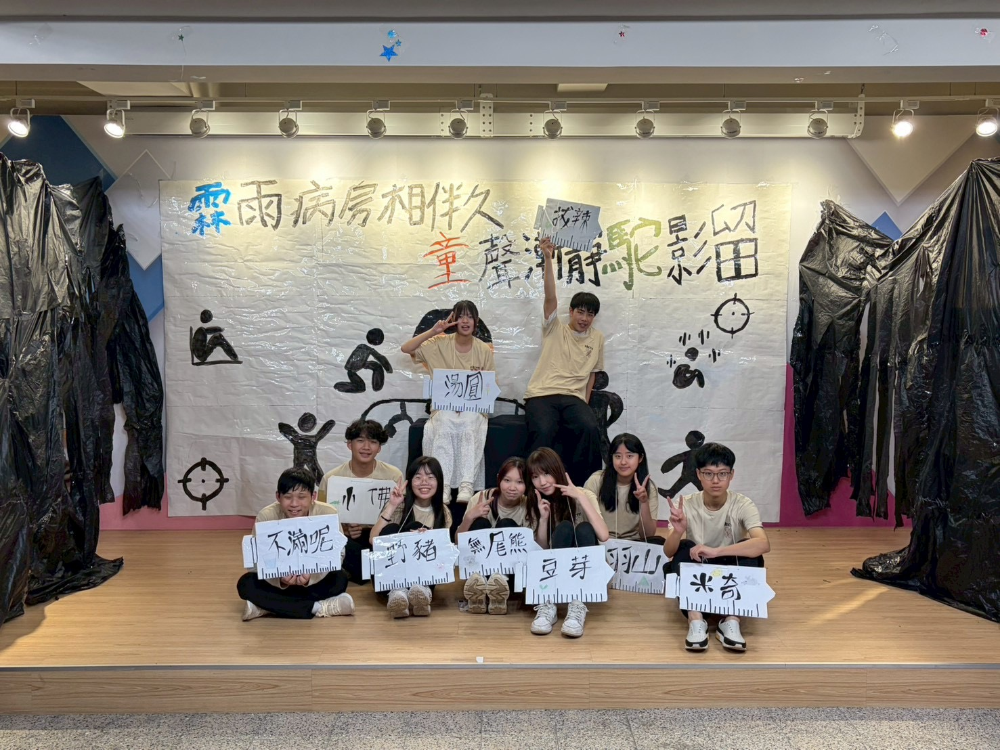

# 康輔社在幹嘛？
康輔社，就是那群把活動辦起來的人。無論是營隊裡的隊輔、大地遊戲的關主，還是舞台上的主持人與表演者，都是康輔社員最常扮演的角色。
加入康輔社後，你不再只是活動的參加者，而是開始學著設計活動、帶領團隊、站上舞台。從企劃、籌備到執行，每一場活動都由社員共同完成。不需要任何經驗，學長姐都會從零開始帶著你學，只要願意投入，每個人都能找到屬於自己的舞台。

!［一活照片］（IMG7429.jepg)

# 活動內容
高一時，我們主要會舉辦各式各樣的活動。除了校內活動之外，也會到偏遠國中、育幼院等地方帶活動，透過一天的營隊，陪伴大家度過充實又難忘的一天。
活動內容包含大地遊戲、團康、爆笑劇、音樂愛情劇，以及建中目前少數仍保留的手語、土風舞等特色表演。從活動企劃、排練到正式演出，每個人都有機會參與其中，留下屬於自己的高中回憶。

！［二活照片］(IMG8877.jepg)

?友社交流
其他除了建中之外，我們也經常與北一女中康輔社（童軒）、師大附中康輔社（御天）、松山高中康輔社（松霖）共同舉辦活動，也和許多其他友校保持交流。
加入康輔社後，你的朋友圈不再只侷限於建中，而是有機會認識來自不同學校的朋友。一起籌備活動、一起熬夜趕流程、一起完成一場活動，很多人最後都成了高中最珍貴的夥伴。

# 常見問題
Q：有學長學弟制嗎？
A：現在基本上建中很多的社團已經沒有學長學弟制了。我們比較像是一群一起辦活動的夥伴，學長姐都很樂意幫忙，有問題都可以直接找，我們更希望大家把彼此當成朋友，而不是有距離的學長學弟。
Q：我很內向，適合加入康輔社嗎？
A：當然可以！其實大家剛加入時都彼此不認識，也不是每個人天生就很外向。康輔是一個可以慢慢練習與人相處、學習表達的地方，不論是社恐還是社牛，都能找到適合自己的位置。
Q：加入康輔社會不會影響課業？
A：社團一定會花一些時間，但只要做好時間規劃，課業和社團完全可以兼顧。社團帶來的不只是活動本身，更是一群一起努力、一起成長的夥伴。

對了這是我們的 IG，可以去看一看
[駝鈴康輔52th_IG](https://www.instagram.com/ckcf_52?igsh=MW9qaG4zNTdkcmNlZg==）

