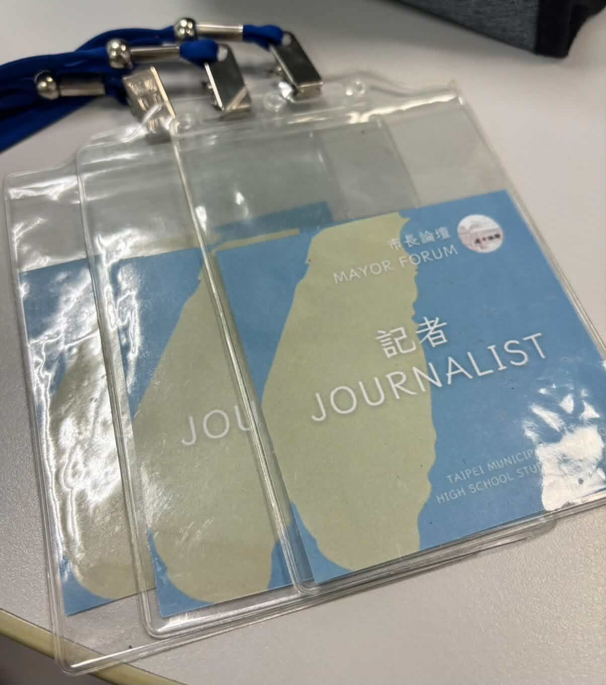
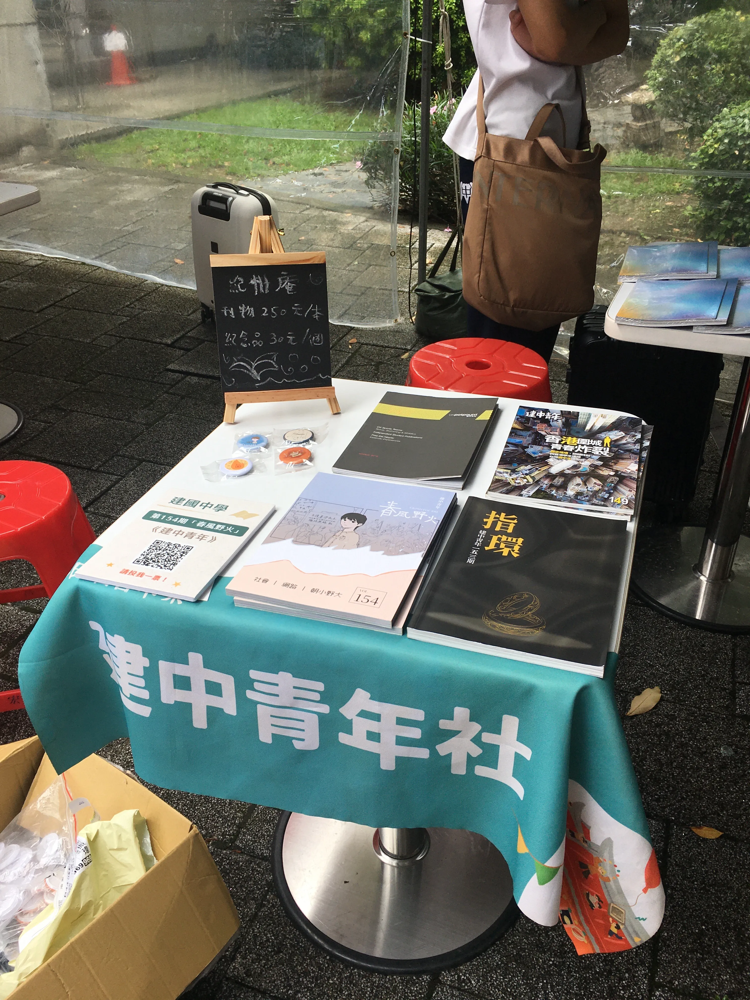

# 建青歷史
建中青年的歷史已逾七旬，截至今日，已發行一百五十四期校刊此豐碩的成果。而我們亦遠不止是校刊社，更是建中生的獨立媒體。在此，大家皆可以文字與設計為載體，為自身的理念發聲。
建青之伊始深蒙陳獨秀先生於一九一五所創立的《新青年》影響，由一眾對自由、民主、科學與進步抱有期許的學長所創立。昔年，建青嘗為發行戒嚴時代不被允許之內容而遭查封。於復刊後，亦走過黨國體制的嚴厲審查。浸漸的，在時間淘洗下，建中青年慢慢脫離體制：在第一百三十三期，刊物的購買從強制訂購轉為自由購買；在第一百四十二期，因時編輯團隊撰寫“解放乳頭運動”而使校方不悅，自此建青與校方脫鉤，立下“不接受校方審稿，亦不接受校方補助”的原則，亦自此成為完全獨立的學生媒體。
十載過去，自反送中至朝野對立、自校園紫背心校安問題到走入歷史的建中合作社，建中青年始終堅守獨立而深刻的報導，用尖銳的筆鋒展現關懷。

# 刊物編寫
現今的建中青年為每年一刊。在九月時會將該年度的刊物主題大致擬定，一路到十二月左右截稿、排版、出刊。彼時建青全體成員的心血結晶，便會在油墨香中，飛紅出來。
刊物內容的部分，會有一個大致上的主軸，但是每個成員也都有參與決定的機會，可以選擇自己想寫的議題。在建中青年，不需要委屈自己寫一些自己不想要寫的東西；亦不需要幫學校、班聯業配，淪為沒有主見的側翼。除了文字內容的撰寫，諸如排版、攝影、採訪、甚至封面制作都會由我們獨立製作，因此成員們也能自由選擇撰寫以外的工作。
在刊物製作的過程中，除了能在社課學到編輯刊物或是採訪技巧等知識，我們更重視的是以一個雜誌編輯者的角度，培養對社會議題的敏銳度，並輔以文字表達、呈現自己的觀點。

# 社課內容和社團活動
# --社課內容--
我們將會於社課中探討各式社會議題，討論出屬於每一位建青成員的一本刊物。我們也會一起學習關於刊物的美編、排版、製作等知識，於中央社擔任記者的社師也會與我們分享採訪和報導的經驗。

# --友社交流--
從友社之間的聯合迎新、聖誕晚會、聯合寒訓，到規模更大的紀州庵校刊競賽、南方編輯交流會、全國編輯交流會，皆有建中青年現蹤。其中，更是可以與同樣對編輯刊物抱有熱忱的人們一起交流。

# --市集--
每年十二月牯嶺街的書香市集以及七月的紀州庵刊物市集，建青都會在市集擺攤販賣刊物，可以在那邊認識到很多不管是對文學或是社會議題感興趣的人，也可以體驗到如何介紹刊物，以及與顧客交流刊物內容。

# 理念
建中青年社每屆最重要的成果僅是一份刊物，但在73年的積累下，已有了155本的豐厚成果，這一落落書籍乘載著一代代人的寶貴的青春歲月，以及他們對進步社會的期盼。
歷屆學長都十分懷念待在青年社的時光，也將這段時光視為他們生命中最自在、最幸福，也留下了重大影響的經歷，感受到「一群人為了同樣理想而奮不顧身」並經過無數個深夜的熱烈討論，締結深刻難得的情誼。
青年社刊物最引以為傲的，是獨立而深刻的報導，在尖銳的筆鋒下，流露出對身邊、對台灣、對世界的關切，志在創造一個能讓不同立場來相互碰撞磨合的平台。在大量資訊氾濫的潮流中，守住一個能自由創作、針砭時事的溫暖角落。
