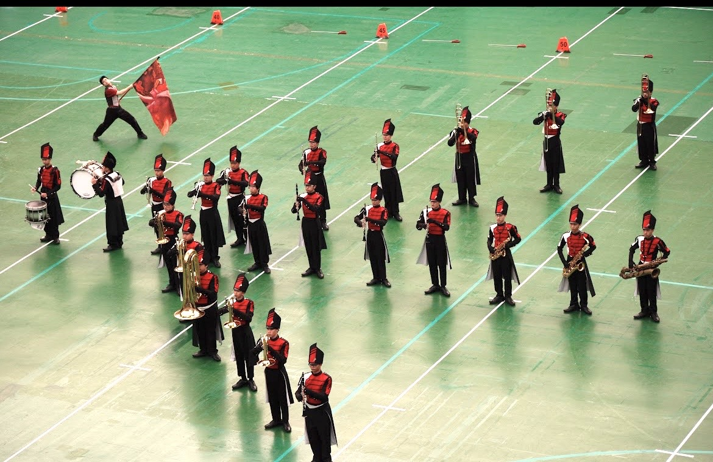
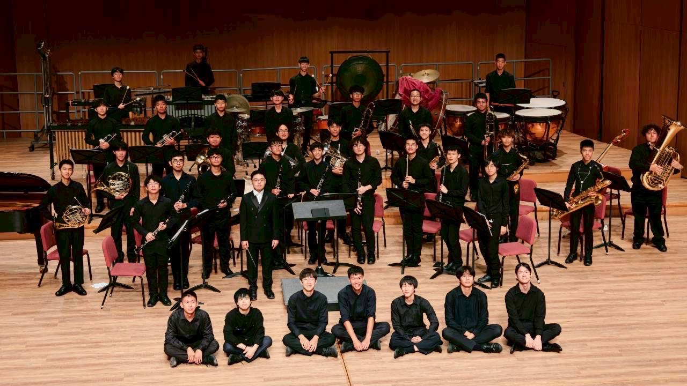
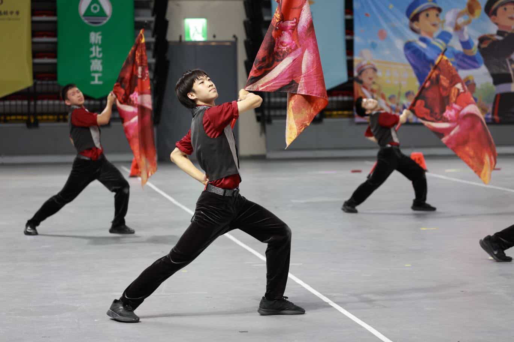
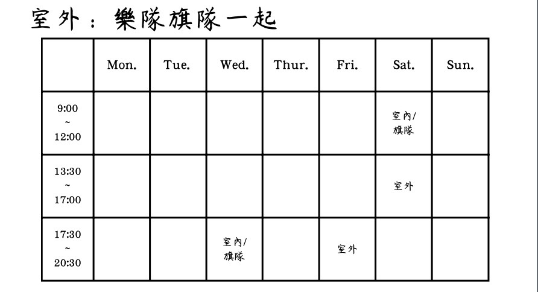

# 建中樂旗是什麼
我們是一支美式行進樂隊，由樂隊和旗隊組成，在演奏樂器及舞動旗槍的同時，再搭配各式各樣的隊形變換及動作，帶給觀眾聽覺與視覺的雙重震撼

# 只有室外表演嗎
我們也有室內樂的演出及比賽，且不論室內室外全國賽我們都是特優隊伍，一年兩次的成發也都是以室內的方式演出

# 旗隊在做什麼
旗隊可以拋槍、拋旗，還可以執行很多特技動作，在演出時也常常會有各式各樣的道具，表現的張力絕對不輸樂隊

# 不會樂器也可以加入嗎
當然！只要你對樂器或旗槍有興趣，完全不需要擔心跟不上大家，本屆2/3的學長都是高一才初學樂器，經過不斷練習及學長指導，一定能漸漸得心應手

# 團練時間參考

# 最後
你也會獲得廣大人脈，不管是同儕、學長或是友校同學，未來都會是各領域的人才。不想成為只會讀書的建中生嗎？想要和一群人一起譜出一份青春的樂章嗎？建中樂旗歡迎你的加入。
「人生最重要的不是成就了什麼，而是和誰一起完成了什麼」
「不是會了才做，而是做了才會」

這是我們的IG，有興趣歡迎看看
［建中樂旗44th_IG］
（https://www.instagram.com/ckmb44_zenith?igsh=MTFwYWVwNTEzMjJlcw==）
