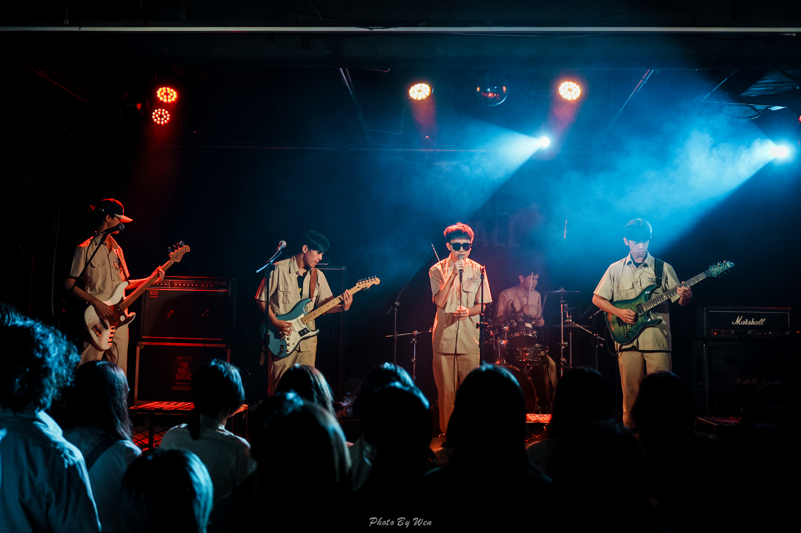

Q1:沒有音樂基礎能加嗎?

可以的!有的人在升上高中前都沒有碰過樂器，因此我們的教學學長會在各個樂器的小社課盡量幫助各位，只要對音樂有著熱情加上瘋狂練習，大家都可以掌握自己的樂器喔。

另外,小社課有機會請來大學長分享演奏經驗喔!

Q2:有哪些友社、活動?

我們的友社有景美熱音、北一熱音、成功音創、中山炫音、附中吉他，我們時常跟這些友社一起演出。

一學年的活動則有迎新、各校舞會、寒訓、六校熱音聯展，與大型成發。

Q3:正社沒上熱音怎麼辦?

可以私訊社長或填寫主頁的地社表單，正社跟地社的差別只有禮拜五的社課而已，所以不用擔心。

Q4:有學長學弟制嗎?

雖然我們很不幸地有這個制度，但我們發誓我們絕對不會亂罵人!這個制度僅是為了方便社團的管理而已，大家還是可以成為非常好的朋友

