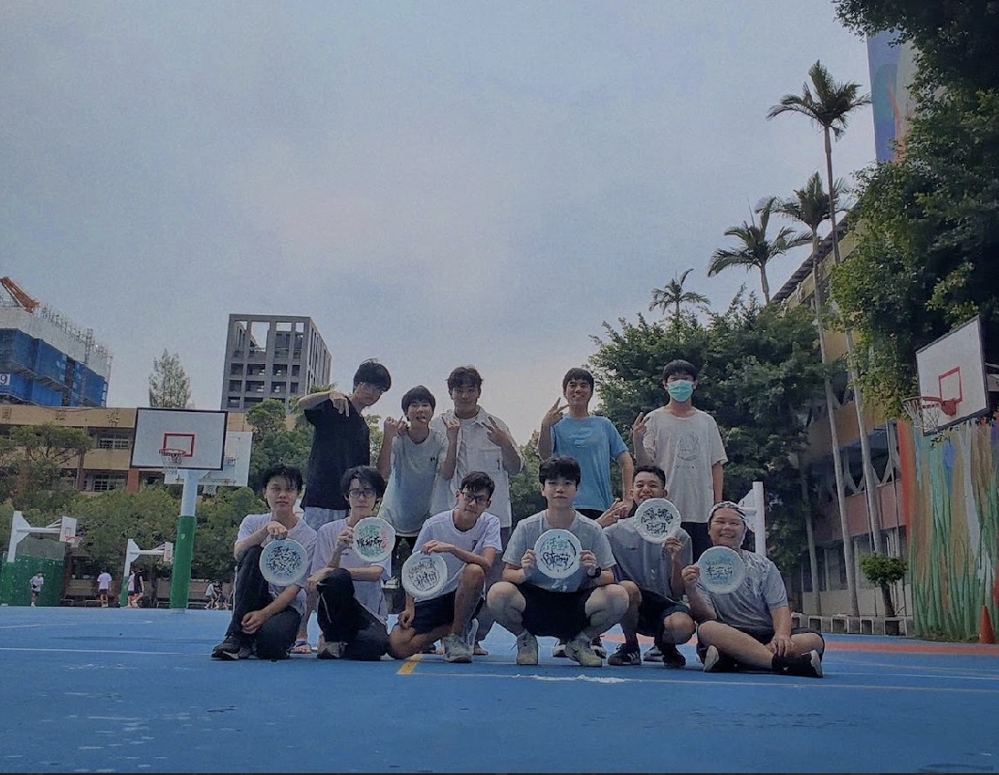
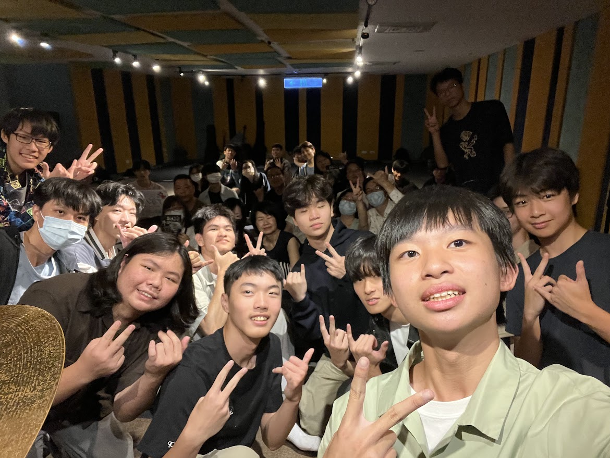

# 另音是什麼？
另音全名為**另類音樂創作社**，顧名思義，我們是一個**創作歌曲並且自己演奏出來**的社團。這裡是不限曲風、不限樂器、不限語言的創作性社團，從靈感到舞台都由你作主，譜出屬於自己的作品！
我們歡迎這樣的你：
→腦中時常浮現自己的旋律，想要將它表達出來
→想要組樂團，嚐嚐青春的滋味
→沒有任何基礎，但對於創作有很多想法
→有超深厚基礎，但對創作沒那麼多想法
→有超深厚基礎，對於創作也有很多想法
→沒有任何基礎，對於創作沒那麼多想法

# 課程介紹
**大社課**：我們會教導各位如何創作出專屬於自己的曲子，包含基本軟體介紹，不基本軟體介紹以及各種編曲技巧！
**小社課**：每週5次，中午或放學，有**vocal**,**吉他**,**貝斯**,**爵士鼓**,**keyboard**五種小社課，大家一起快樂學習新樂器，如果你是零基礎或大神也都沒問題喔！

# 活動介紹
我們社團舉辦許多活動，不但有成果發表會，還有許多與友社的交流活動，例如秋季烤肉、冬訓以及寒遊，透過這些機會來拉近彼此與每個學校間的關係，同時也可以創造更多機會與朋友！

# 社團特色 
身為一個提倡自由創作的社團，我們的社風也很自由了，社辦可以隨意進出，大家也都十分的開放友善，當然，**沒有學長學弟制**。
我們也非常歡迎各種人，不管你喜歡台灣歌手、日本樂團、蒙古圖瓦喉音還是新德意志硬派搖滾，我們都非常需要你的加入！
如果你自認是社恐也沒關係，在這裡，我們保證每個人的才華與作品都能被看見，這裡是夢想發芽的場所！(社長就蠻社恐的）
順帶一提每一屆的畢業歌也都是我們寫的喔！
時光飛逝，對於青春洋溢的高一生活，我們只能盡可能珍惜。也許社團生活不會像漫畫中光彩，但是其中的點點滴滴，也都是青春的一部分，而這份青春，值得我們好好品味。（寫一寫突然好感動😭）

關於我們
歡迎追蹤我們ig: https://www.instagram.com/ckimc_26th?igsh=MWVqbTZ0ajczajFwZQ==
我們的官方網頁：https://ckimc26.chenray.me/?utm_source=ig&utm_medium=social&utm_content=link_in_bio&fbclid=PAdGRleATAiphwZG9mAmV4dG4DYWVtAjExAHNydGMGYXBwX2lkDzEyNDAyNDU3NDI4NzQxNAABp9vetsO7i-h8lizQ2-3Cb7r-YBlq7xt1uiK1-Sg23DVb85ogoIQmHvq_QW0f_aem_EvgD40yPlefeLJwxU_7fDA
