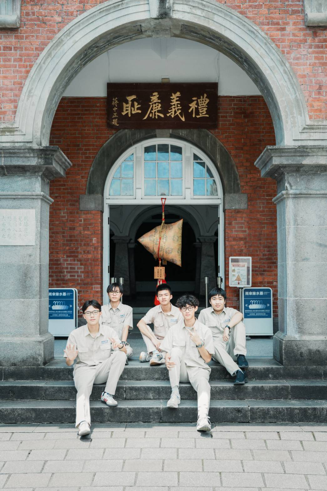

* 什麼是指彈（Fingerstyle）？
指彈是一種只靠一把吉他，就能同時彈出旋律、伴奏、低音，甚至打擊節奏的演奏方式。和一般刷和弦或自彈自唱相比，指彈更注重演奏的層次感與完整性，因此就算沒有唱歌，也能把一首歌完整地呈現出來。看起來很厲害，但別擔心，我們會從最基礎開始教，慢慢累積技巧。

* 沒有基礎可以加入嗎？
當然可以！其實每年都有不少社員是從零開始學吉他的。無論你有沒有音樂底子，我們都會安排完整的教學，從挑選吉他、認識基本姿勢、左右手技巧，到第一首完整的曲子，都會有學長手把手帶著你學。不需要擔心跟不上，只要願意練習、有興趣，一年下來一定能看到自己的進步。

* 社團有學長學弟制嗎？
沒有！完全沒有！我們沒有嚴格的學長學弟制度，也不會有人沒事擺架子、亂罵人。大家平常相處都很自然，有問題就互相幫忙、一起討論，希望每個加入社團的人，都能在沒有壓力的環境裡安心學琴、享受音樂。如果有學長讓你感到壓力，歡迎跟其他學長講，我們幫你低閉他！

如有其他相關問題，歡迎私訊詢問學長們～
林維楷｜社長 @n.ame.0413
戴子高｜副社 @foreverfaith9595
江承恩｜公關 @chan_n.9898
社帳｜@ckcg_52nd
