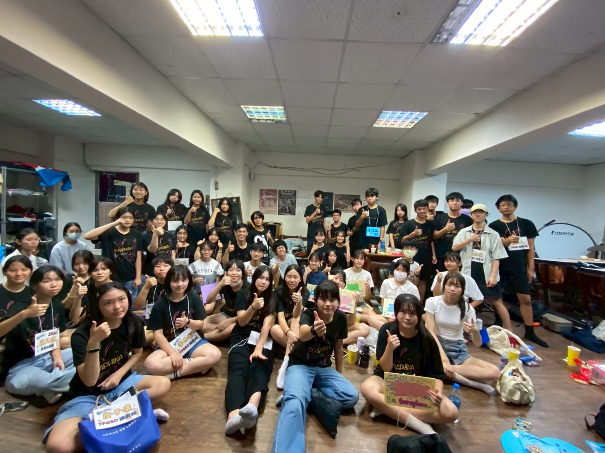
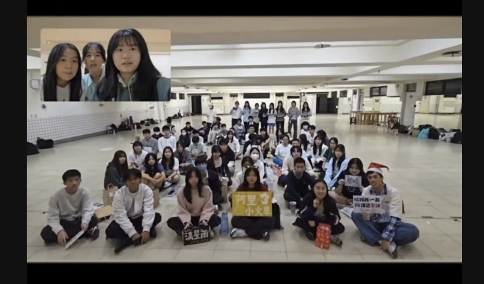
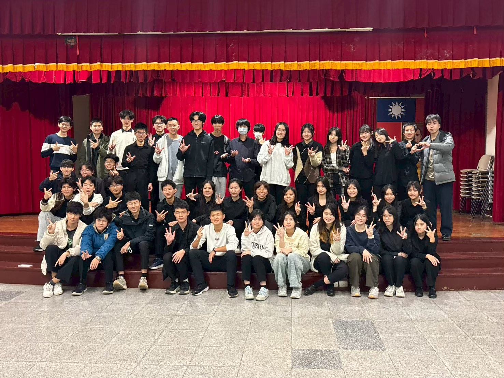
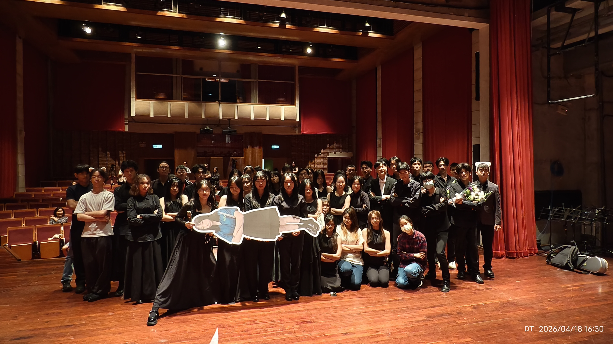
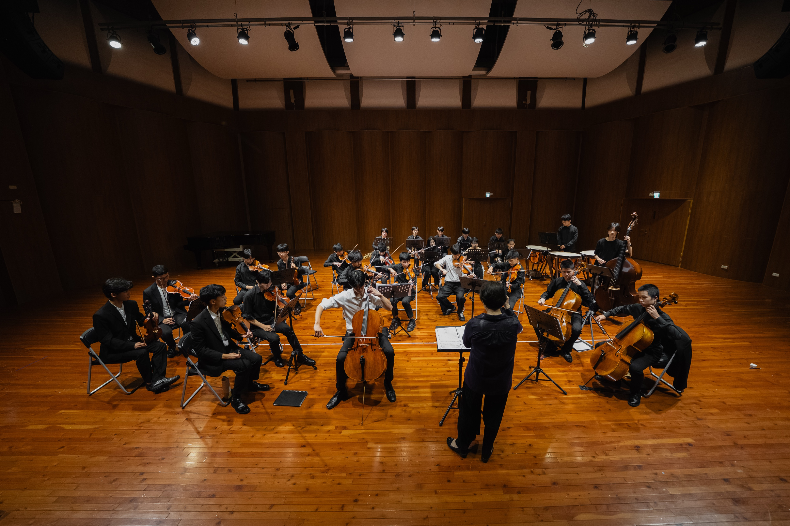

# 管弦在幹嘛？
言以蔽之，我們練琴、表演、比賽。並透過和友校合辦活動，互相交流、切磋。如果你想玩音樂同時兼顧學業，那麼建管絃絕對是你的第一首選。

# 友社介紹
八校管弦包含：建中管絃、北一絃樂、附中愛樂、成功絃樂、中山絃樂、松山絃樂、大同絃樂和明倫管絃。

# 活動介紹
八校聯合管絃迎新：由中山弦樂主辦，包含大地遊戲等環節，是破冰認識外校的起點。

八校管弦聯合聖晚：松山弦樂主辦，各學校的學長姐擔任關主和隊輔的闖關遊戲，可以透過遊戲、小組競賽認識友校的同學。

八校管弦聯合寒訓：建中管弦主辦，三天兩夜的行程中包含桌遊競賽、小組闖關遊戲、夜教等等，刺激好玩。
（個人最推的活動）

八校聯合小型成發：北一弦樂主辦，可以和友校組室內樂，並發表，是八校最後的大型活動。

建中管絃大型成發：建管弦的最後一個活動，可以組室內樂、也有大團演出，是這段時間努力的見證。

# 社課＆小社課時間
我們社團社課時間為分部練習，而週一管弦小社課及週四弦樂小社課則分別由不同老師指導，練習時間為16:00~19:00

# 學弟加管弦，歡樂一整年🫵🫵🫵！！！記得追蹤我們的IG社帳cko_51st，並填寫入社表單喔https://forms.gle/RxBUdXjwyk71BX2B6
