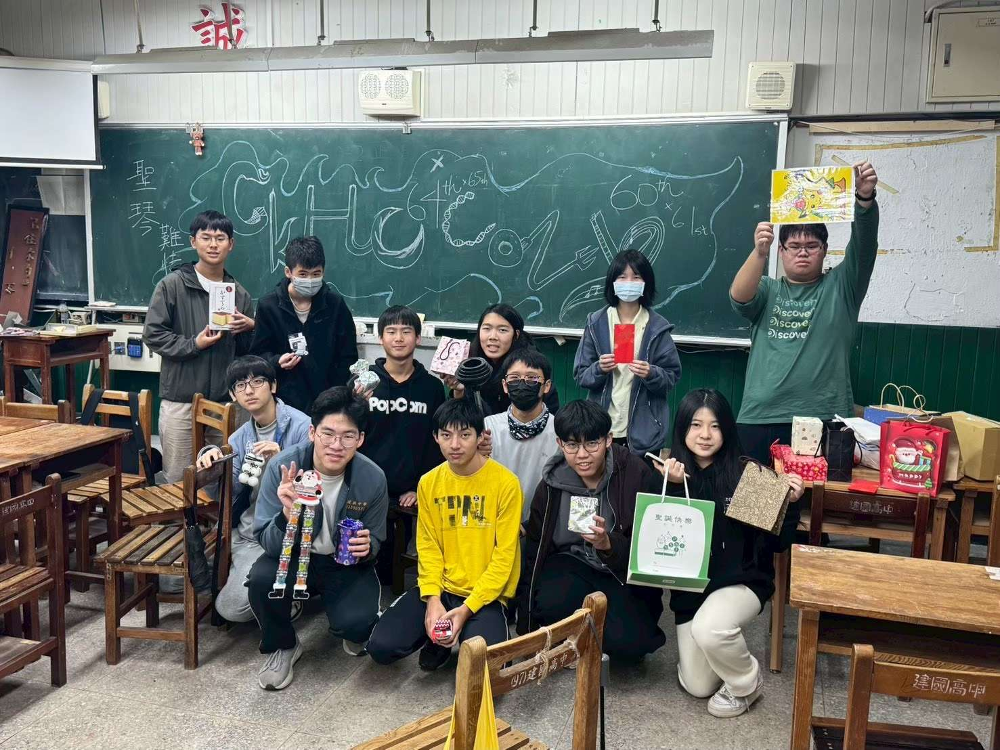
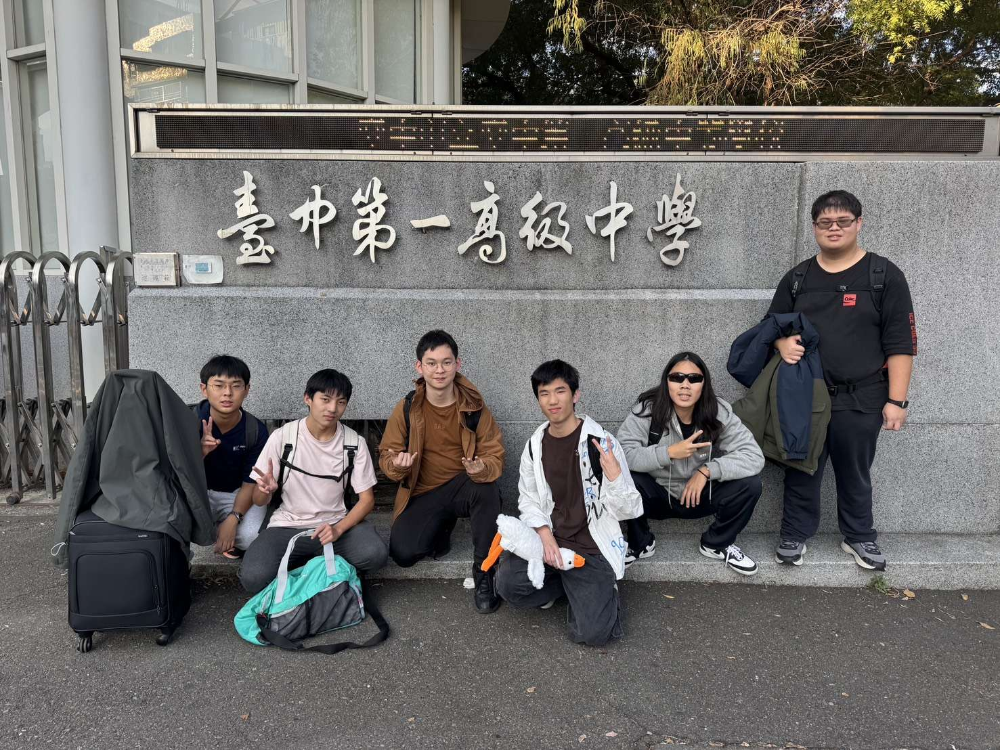
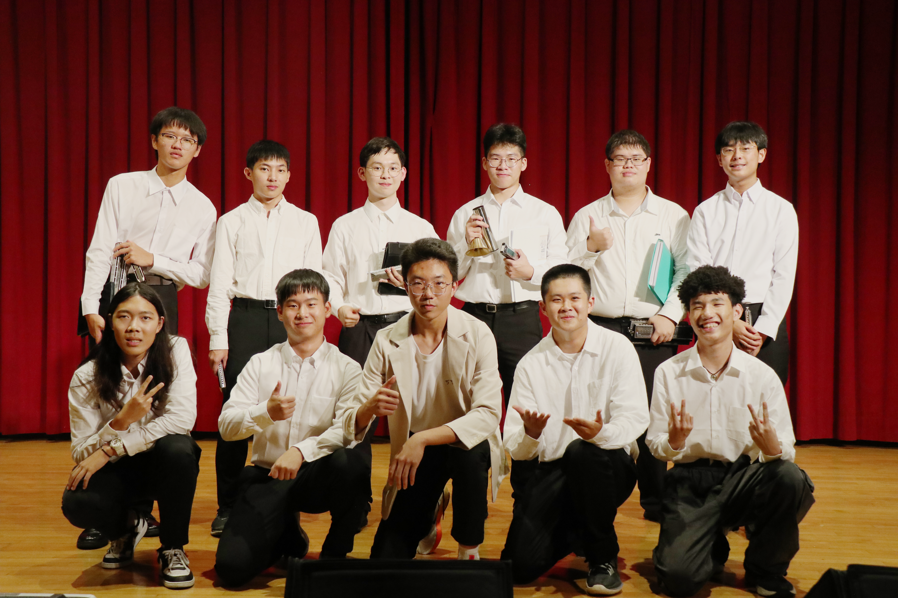

# 為什麼你應該加入口琴社？
口琴社十分棒，雖然人不多，但我們的凝聚力特別強。
口琴易上手，僅幾堂課就可以讓你吹出優美旋律！
我們的社費低廉，一學期只須500元，就能獲得專屬於你的兩把口琴！
我們的社辦環境良好，不是在地下室，還離室內籃球場超近，根本風水寶地！

## 溫暖的氛圍
都2026了，我們當然沒有學長學弟制。但是我們有...
人超好的學長們
龐大的校友會
溫馨的社辦（不會漏水）
各種稀有的絕版口琴
還有更多等你來發掘喔
## 為什麼我們勝過其他音樂性社團？
如果你會鋼琴或是吉他，那其他人可能根本不會在意，因為他們都會；反觀如果你會口琴，同學一定會對你投以驚奇的目光，再請你吃超高檔自助餐
口琴超級輕便，可以陪你上天下地，如果其他樂器的話，又不能搬著一台鋼琴或一根小號到處跑，重死了。
口琴十分簡單，只要學幾堂課就可以吹出喜歡的歌曲（除非你喜歡什麼李斯特蕭邦），反觀其他樂器可能學一年都停在基礎，極為毒瘤
口琴超便宜，入門款式只要200元，適合學生族（其他音樂性社團的社費動輒上千），我們還會直接送你兩把口琴，你甚至不用自己買
而且口琴超帥的好不好，吊打任何其他樂器
## 零基礎可不可以加入？
此生從沒碰過口琴，甚至連聽都沒聽過嗎？
別擔心！因為社長本人，以及我們的社員剛加入時也是一樣的，但在學長的超強教學後，我們已經能自信地上台吹出美妙的旋律了！
## 充實的活動
 - **迎新**
>我們會和北部學校的口琴社合辦迎新

 - **聖誕遊**
>和中南部學校的口琴社出去玩

- **成發**
>讓你在上百位口琴社校友面前大展身手 

- **哈**
>和北一合唱團合辦的聖誕節活動
你能猜到為什麼叫做哈嗎？
 - **寒暑訓**
>寒假和暑假的口琴特訓（其實都在玩）
保證讓你口琴技巧突飛猛進！
