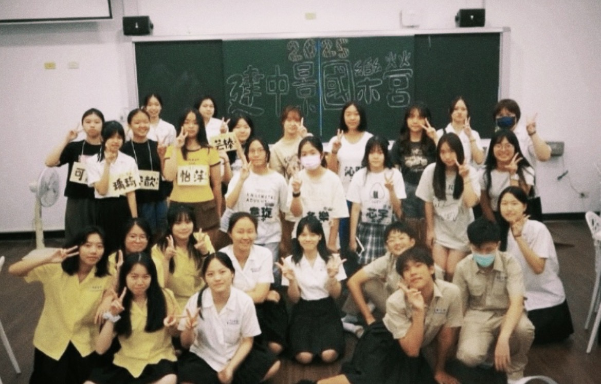
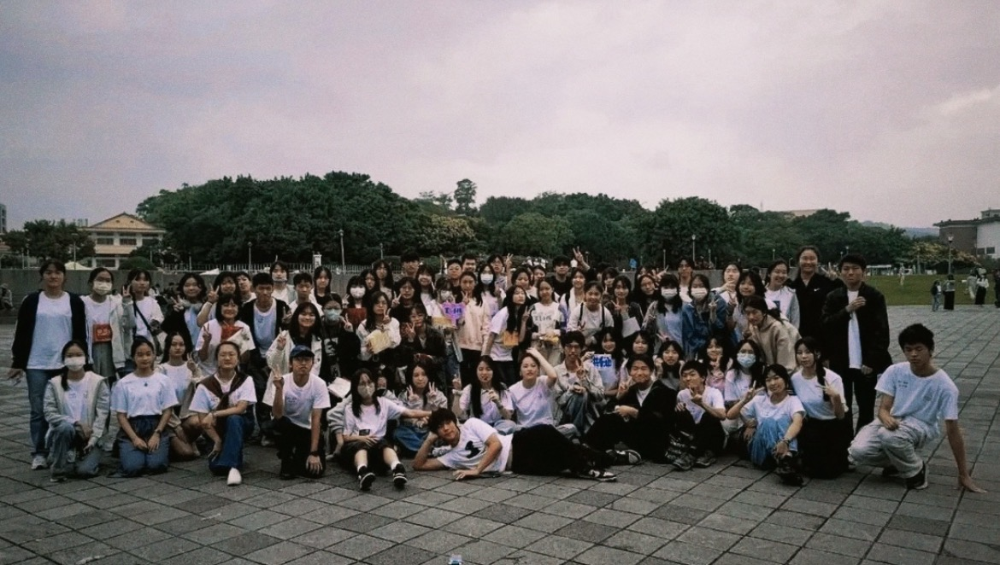
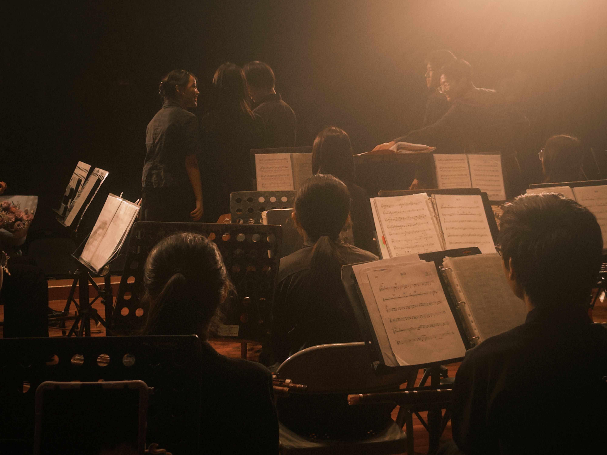
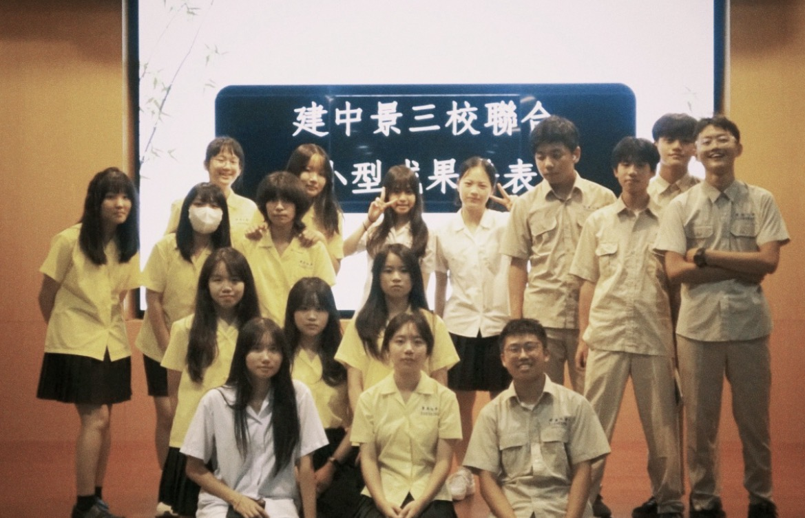
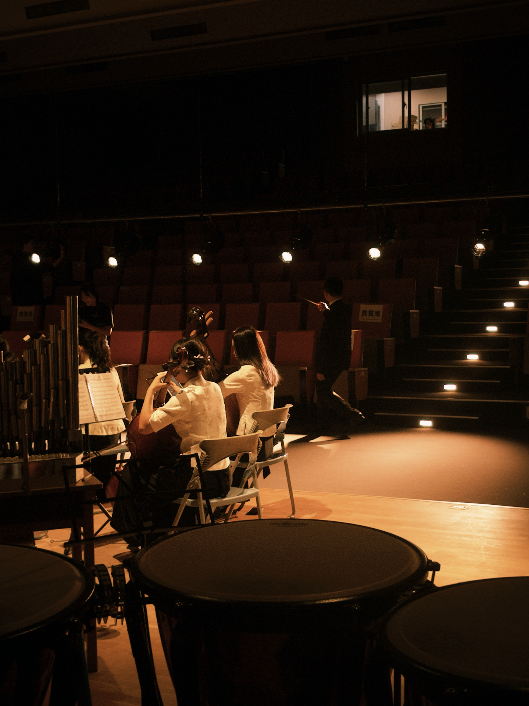

# 哈囉學弟！歡迎加入國樂社！
我們已經拿下了連續兩年的絲竹室內樂全國特優！本社是一個零基礎友善的社團！許多學長都是高中才開始接觸樂器並且慢慢愛上，我們會傳授你基礎的技巧或是幫你找老師，不用擔心進步不了的問題！學長不會學帝雉只會在社辦睡覺，你可以無壓力的過完充實又快樂的一年喔！而在國樂社將會有許多活動，包括比賽、去各處表演、和中山和景美合辦的國樂營、迎新活動和聖誕晚會，以及大小成果發表！另外，我們還有能和許多校友一同參與的建中山校友團演出！

# 建中景國樂營
由學長姊介紹樂器與表演，還有精心準備的遊戲可以體驗，以及可以初次認識友校同届的朋友喔！

# 三校小迎新、十校大迎新
三校小迎新能認識中山、景美的朋友，在未來也將會有許多機會和她們一同合奏；而十校大迎新則是和北一、附中、中山、成功、松山、板中、新北、內湖、景美一起舉辦，除了有趣的競賽，更能認識大台北中各個國樂人，結交其他九校的朋友，拓展交友圈，讓你的交友圈不僅限於建中！

# 多校國樂聯合音樂會
美景當前宜建茗，清風松響花滿成，近年來發展出有跨縣市的音樂成果發表，投入國樂這個大家庭的懷抱並在年底一同出演，增進琴藝及感情。

# 建中景小成
三校小成是給學弟妹們的表演機會，可以獨奏自己喜歡的曲目，還有與同屆的合奏。

# 三校聯合成發
三校大成則是國樂社的重頭戲！建中景三校將展示一年來的成果，所有人一同合奏，在團練的過程中與同儕級學長姊培養深厚的情誼。

