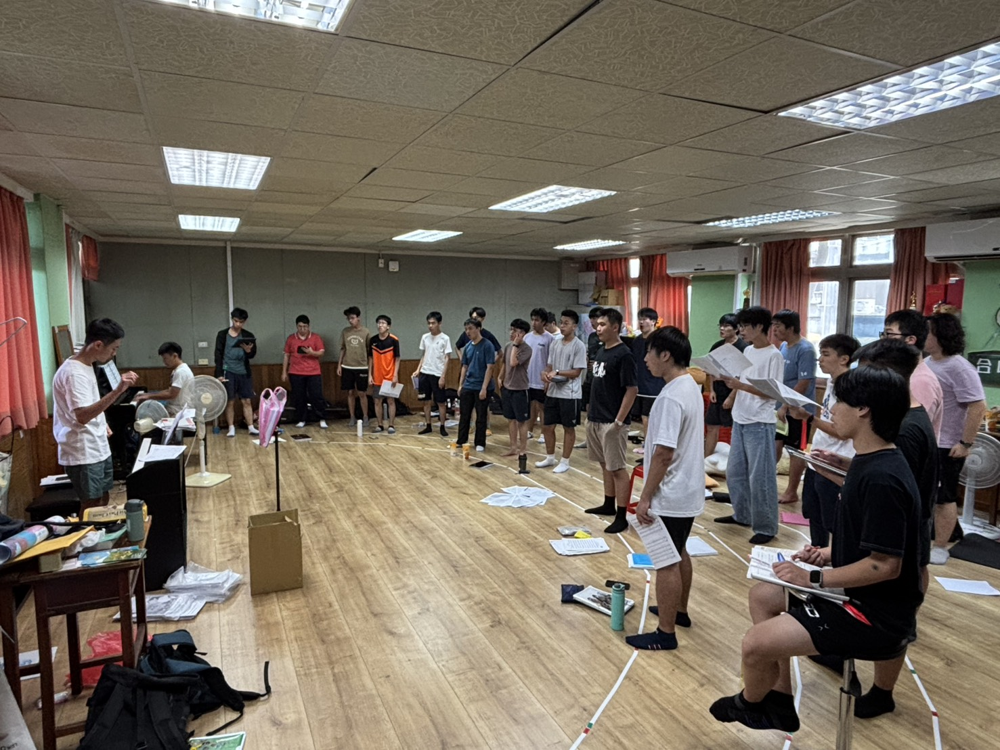
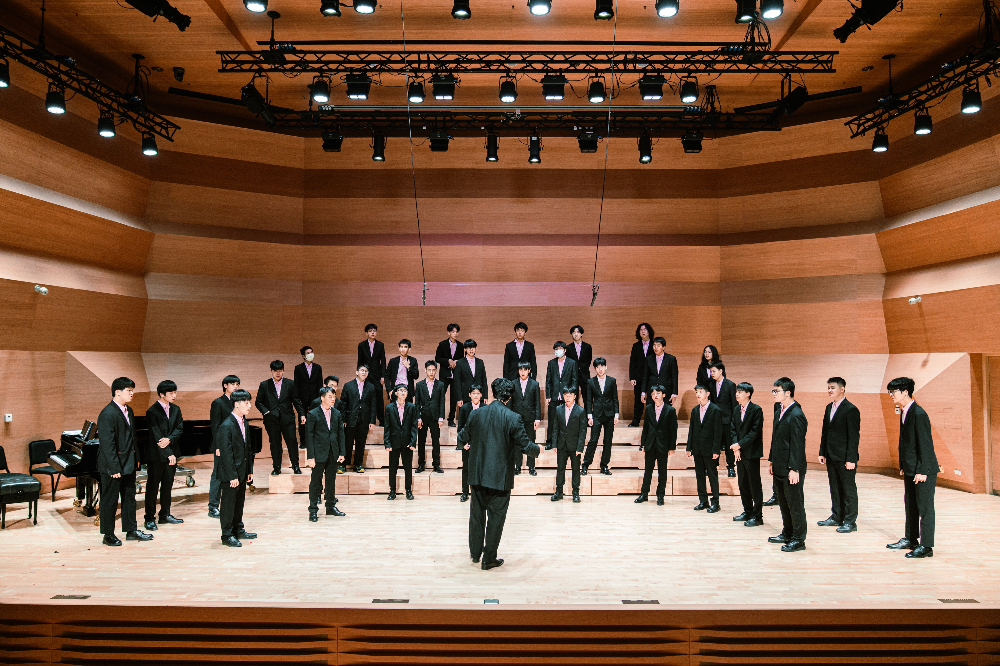
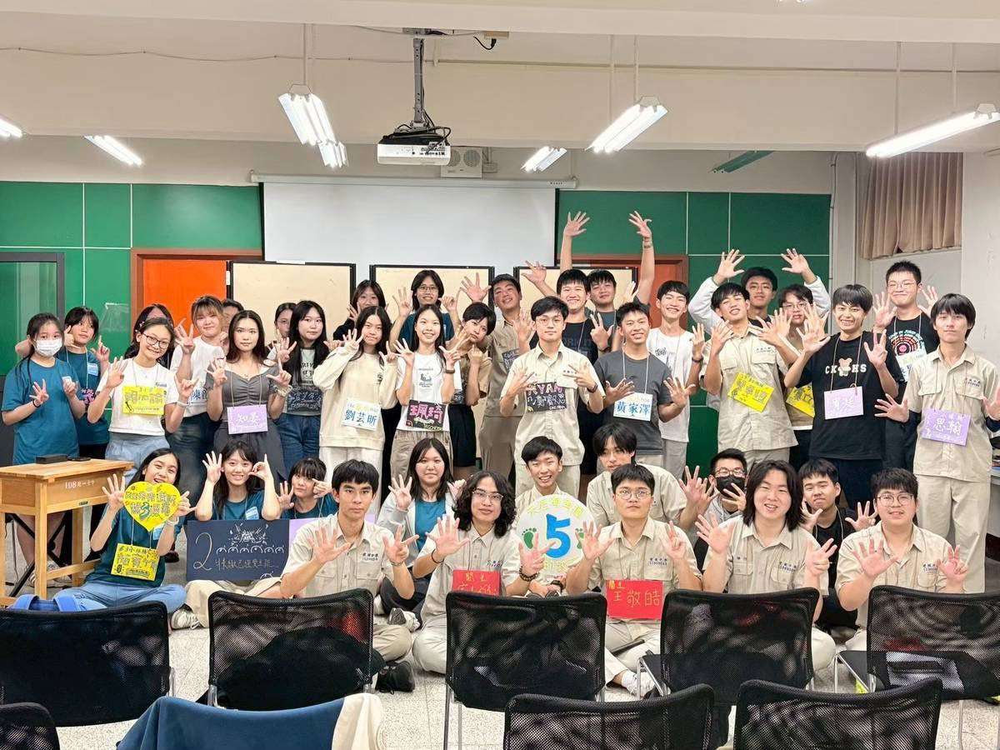

# 建中合唱團在做什麼？

大家好，我們是建中合唱團！

建合是一個充滿歌聲與笑聲的地方，也是一群因為熱愛音樂而聚在一起的人。無論你有沒有合唱經驗，只要願意開口唱、認真練習，都歡迎加入我們。

從文藝復興、古典、浪漫時期作品，到現代合唱、流行改編、民謠、音樂劇，以及台語、客語等不同語言的歌曲，都有機會在建合接觸到。

建合是一個以學生為核心的社團。除了老師指導音樂之外，團務、活動、交流與演出規劃，大多由學生共同完成。

在這裡，你可以累積舞台經驗，也可以學習合作、溝通與團隊分工。每個人都是合唱團不可或缺的一員，每一道聲音都能讓音樂更加完整。

# 建合的日常-團練

每週固定都有團練，分別是週三晚上及週五社課。如果遇到比賽或演出，會安排加練。

不用擔心自己沒有基礎，不會看譜、沒有學過合唱都沒關係。老師、聲部長們都會陪著大家一步一步進步，只要願意學，每個人都能找到屬於自己的舞台。

當然，練團認真歸認真，平常的建合其實也充滿歡笑。休息時間聊天、聚餐、分享生活，都是高中生活中珍貴的回憶。

# 參賽、表演與交流

加入建合後，高一就有許多站上舞台的機會，包括全國學生音樂比賽、成果發表、校內外演出，以及交流活動。

比賽包括全國鄉土歌謠比賽、全國學生音樂比賽等等，透過這些比賽，訓練大家的自信心以及上台的表現能力。

我們也經常與其他學校合唱團合作，在交流、寒訓、邀演等活動中認識來自各地熱愛合唱的朋友，一起上台以歌聲交流。

對我們來說，合唱不只是比賽，更是在每一次演出、每一次合作之中，留下屬於高中生活最難忘的回憶。

# 建合是一個怎麼樣的地方？

我們沒有學長學弟制，也不需要擔心自己沒有基礎。大家一起練習、一起成長，也一起面對每一場演出與挑戰。從第一次開口唱，到站上舞台演出，每一步都會有人陪著你。

在建合，你收穫的不只是音樂，更是一群願意一起努力、一起歡笑的夥伴。

如果你想讓高中生活多一點舞台、多一點挑戰，也多一群能一起唱歌、一起成長的朋友，歡迎加入建中合唱團。

期待在下一次團練，聽見你的聲音。
