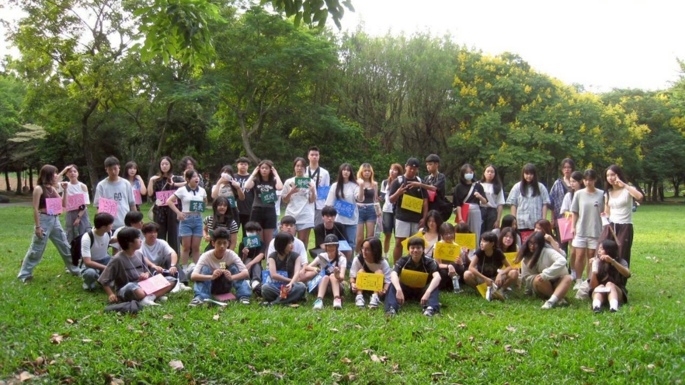
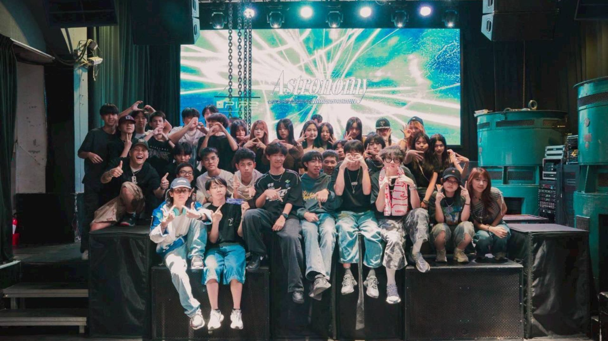
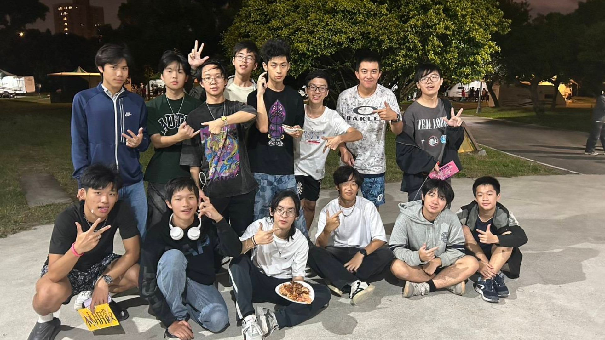
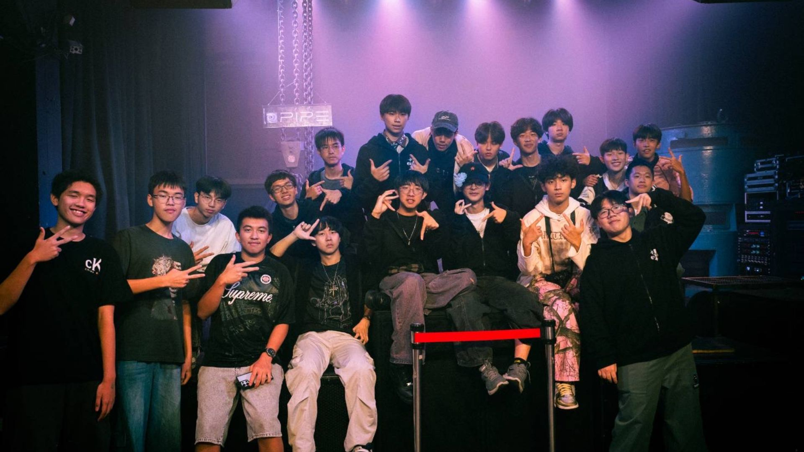
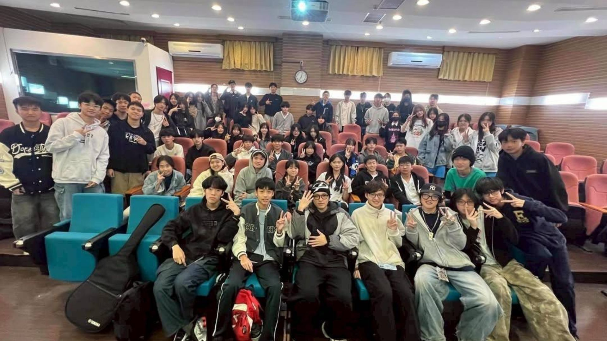

# 嘻研在幹嘛？
嘻研全名是嘻哈音樂研究社，
主要在研究嘻哈音樂以及嘻哈相關文化，主要會教你基本錄音混音以及寫詞創作，大社課(就是學校的社團課)學長會在台上教授個人的技巧以及想法給學弟，幫助你們完成一首完整的歌曲，希望帶給對嘻哈文化有興趣的學弟一些幫助。建中嘻研是一個充滿愛與和平的社團，沒有什麼學長學弟制，加入之後大家都是朋友，在加入建中嘻研後的一年裡你可以學到基礎的錄音混音技巧以及創作寫歌的方式。

**學弟可以在校慶 小成 大成表演，如果時間可行每個人都有上台機會!!!!!**

# 小社課
(就是學校社團課以外的) 
約四周一次，放學後會去校外租場地，讓學弟表演及練習自己做的歌曲，並由其他人提供意見。完全是自由參加。不用吝嗇，請大方分享你的作品，也可以多多跟學長姐交流寫歌。

# 超多的活動
外部迎新(會和友社一起玩遊戲認識朋友)

聯合迎新(表演)

聯合小成(表演)
圖片就是我們網站logo後面的背景

聯合秋烤

大成(表演)

有機會會邀請職業饒舌歌手來演講(我們上次邀請艾蜜莉)

# IG
@ckhhs_8th
https://www.instagram.com/ckhhs_8th?utm_source=ig_web_button_share_sheet&igsh=ZDNlZDc0MzIxNw==
歡迎私訊社帳問題，或是如果害羞私訊社長也可以，他人還不錯。
