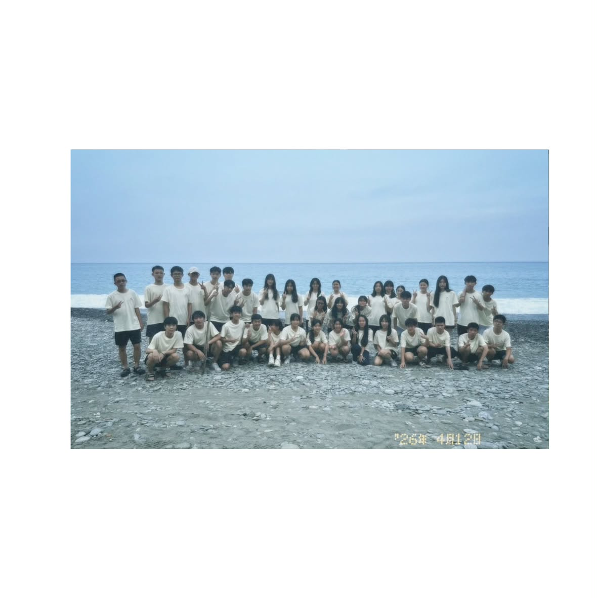
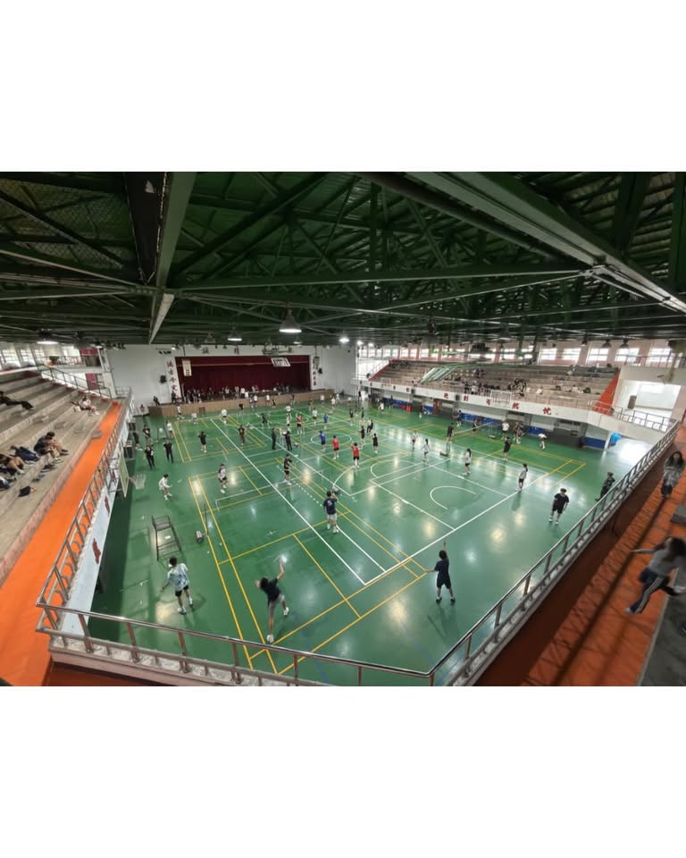
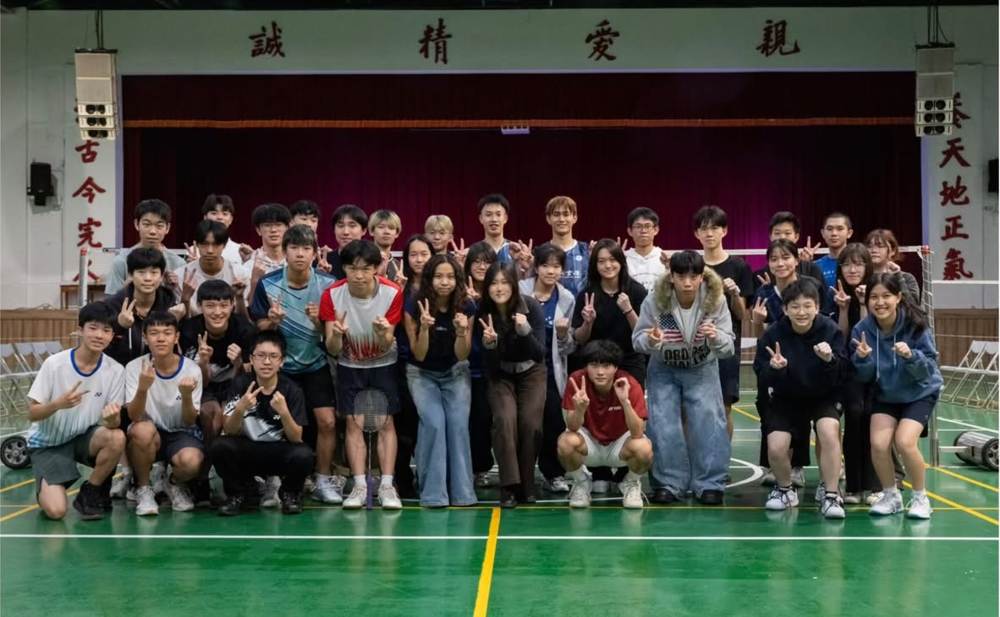

# 羽球社什麼時候可以打球？
如果是正社社員的話，每周五下午第一節會有一節社課
而如果沒選上正社的話，每周三晚上有全校都可以參加的地社活動

# 羽球社有什麼比賽的機會？
我們除了會參加教育盃以外也會舉辦歡樂盃讓大家大展身手
［歡樂杯合照］

# 羽球社只有打羽球嗎?
我們除了每周五的社課還有周三晚上地社外，還會舉辦迎新,春遊等有趣的活動，讓大家度過盡情揮灑青春的高中生活
[迎新合照]［春遊合照］

# 適合什麼樣的人？
適合想要運動的人，我們不僅沒有學長學弟制，也歡迎新手們與大家互相學習球技

# 我們的Ig~更多相關資訊會放在這裡
https://www.instagram.com/ckbc.24th/

