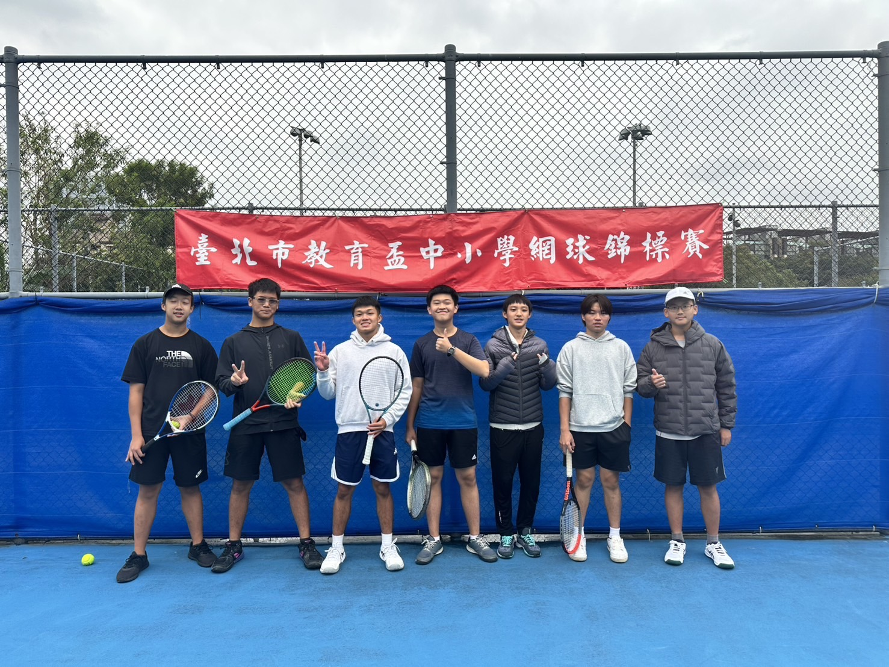
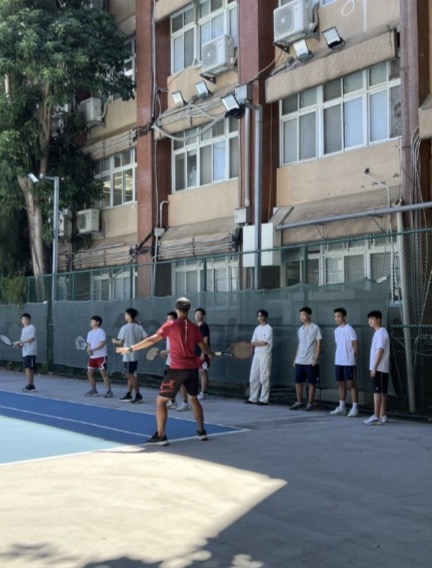

在這裡，你不僅能享受揮拍的快感，更能找到一群志同道合的球友。以下是我們的活動日常與年度亮點：
🎾 我們的球聚與練習時光
 社課專業指導：社課時間有專業教練親自指導，幫你打下最紮實的網球基礎。無論是正反手拍、發球還是截擊，都能從零開始建立正確姿勢！
社員自由切磋：除了教練指導，社課也是大家自由練習的時間。在輕鬆的氛圍下與社員交流，彼此切磋球技。
中午熱血加練：平常手癢了嗎？我們中午偶爾也會相約打球，利用午休時間流流汗、聯絡感情。
社團氛圍輕鬆：沒有學長與學弟之分，打球是毫無壓力且快樂的，我們輕鬆互動、自由交流。
🏆 年度重頭戲：教育盃挑戰
開學後不久，只要我們的參賽人數足夠，就會組隊挑戰「教育盃」！這不僅是一場球技的考驗，更是我們的年度盛事：
 凝聚社魂：在刺激的球場上共同奮戰，能大幅增進社員之間的感情與默契。
 以球會友：跳出校園舒適圈，結交校外同樣熱愛網球的朋友，拓展球友圈。
 榮譽時刻：只要我們籤運與實力兼具，有機會一起抱回獎狀，豐富高中生活！

無論你是完全沒有經驗的新手，還是想找人切磋的高手，這裡都有屬於你的位置，歡迎一起來揮灑汗水！
看完以上介紹後如果對網球社有興趣，不妨給我們一個機會吧！(有任何問題都歡迎私訊社帳：cktc_115)

