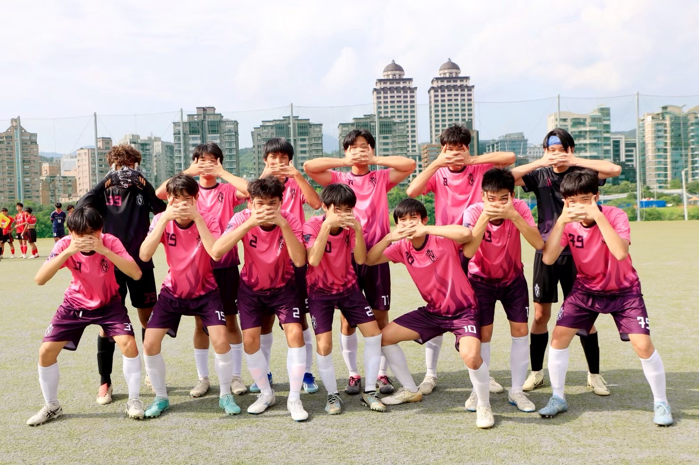
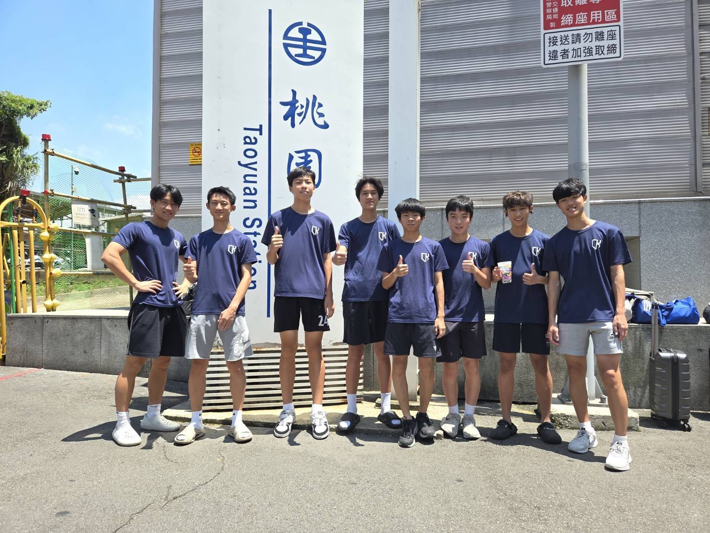
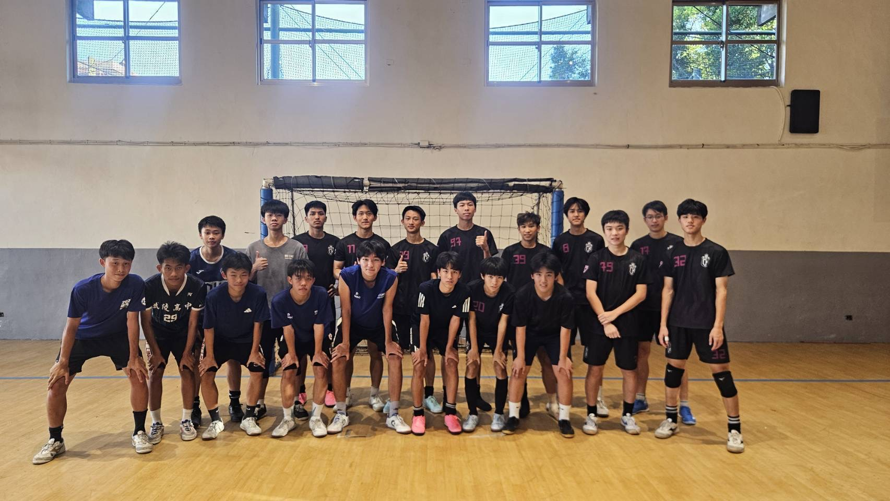
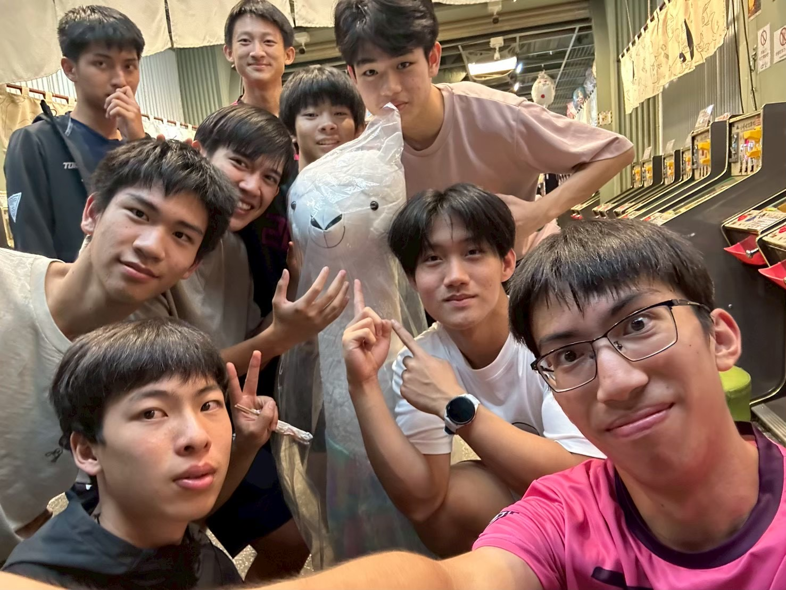

# 關於我們—足球社
建中足球社由一群熱愛足球的少年組成，專攻五人制足球。社課由教練指導，會分成競賽場與新手場，零基礎也可無壓力踢球，學長也很樂意教學喔～每週四放學有小社課，為強度較高的隊內賽。此外，還有迎新、友誼賽、寒暑移訓等精彩活動待你參加。

# 技藝精鍛
參與多項賽事戰績斐然，近幾年我們也連續闖進中等學校聯賽全國複賽，持續挑戰隊史最佳紀錄！在這裡你可以擁有充足訓練與出賽機會，專業的教練，以及一群熱血、執著於變得更強的隊友。如果你有意一展身手，建足絕對是你向世界展現自己的最佳舞台！

# 以球會友
還在煩惱升高中後的社交嗎？足球之神將帶你認識許多有趣的朋友！除了社課一起流過的汗水、一起創造的笑點，四處征戰、移訓過夜的記憶，也都成為我們最愛懷念的話題。不只在建中的隊友，每場比賽更將帶你走向各地建立緣分。在這裡，你一定能獲得許多難忘的回憶。

# “You’ ll never walk alone.”
足球是團隊運動，而建足也以向心力與團隊精神為傲。每一場齊心贏下的戰役、每一聲響徹雲霄的隊呼，都是我們一起走過的證據。除了球場上的並肩奮鬥，球場外我們也相互支持，分工努力，為社團爭取更好的訓練水準。在足球的世界裡，我們都不會孤軍而戰，快快加入我們，一起打造最令人驕傲的團隊。

