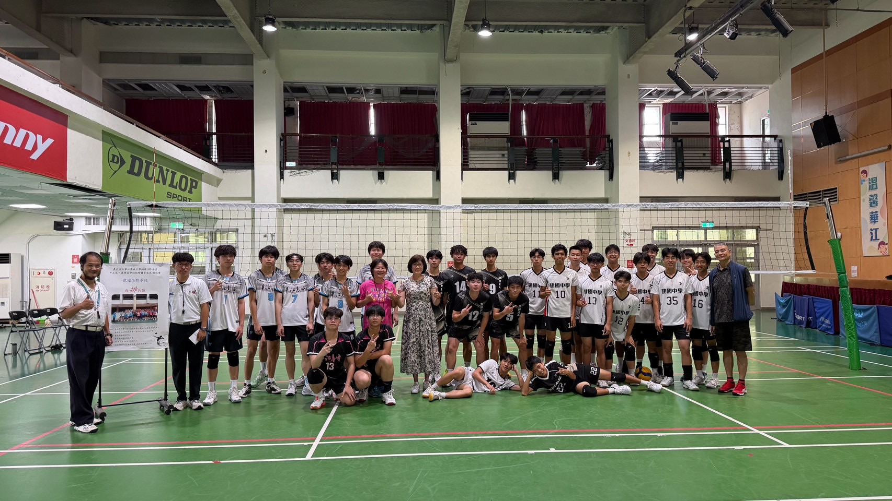
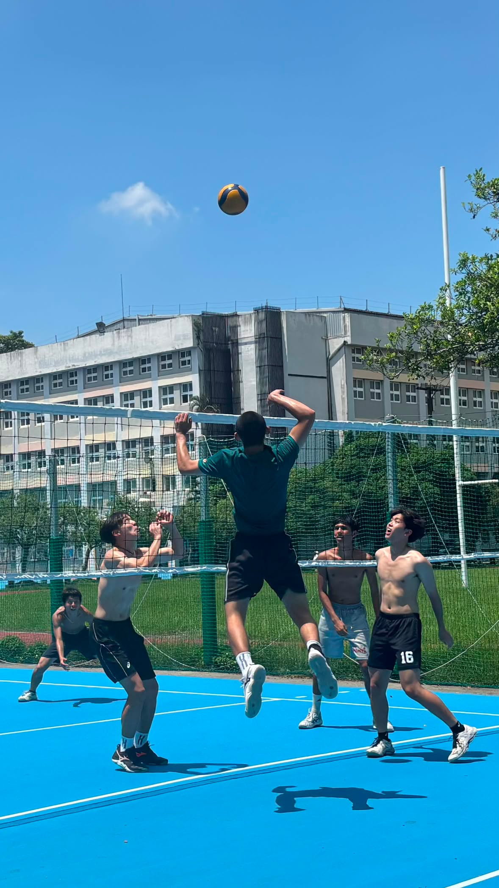
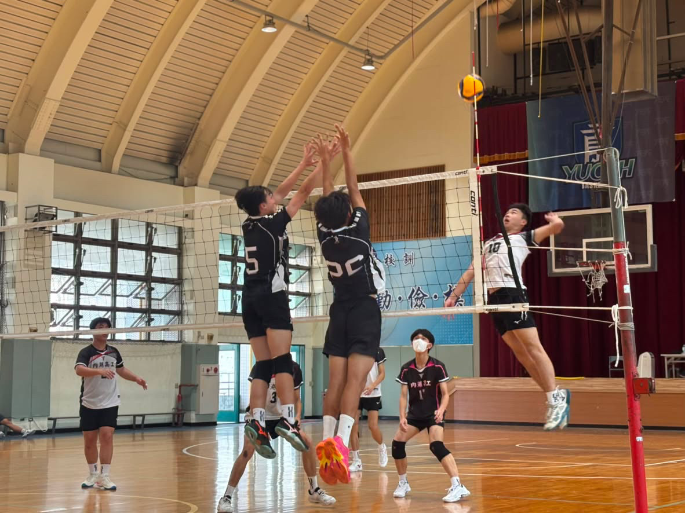
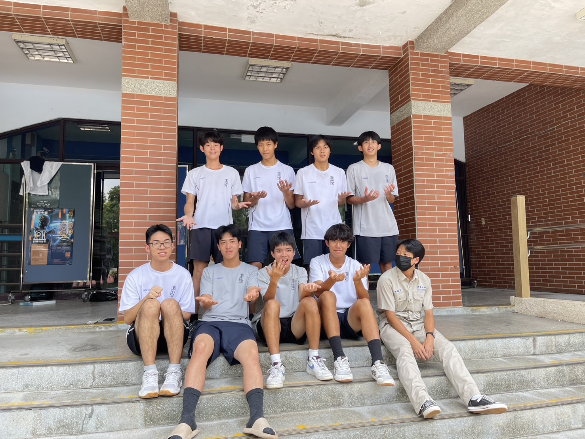
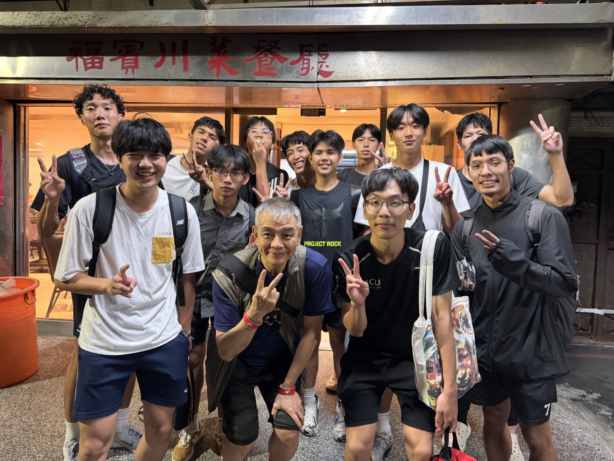

# 排球社在幹嘛？

排球社是一個充滿熱血與歡笑的地方，不管你是從國中就開始打球，還是高中才第一次接觸排球，都非常歡迎加入！

平常社課會安排基本動作教學、分組練習、實戰對打，從發球、接球、舉球、扣球到攔網，都會一步一步帶你熟悉。學長和教練都很樂意指導，不用擔心沒有基礎，只要願意練習，就一定能感受到自己的進步。

除了提升球技之外，更重要的是在球場上認識一群一起努力、一起歡笑的隊友。

# 小社課

每週235固定都有小社課，內容會依照大家的程度安排。

剛加入的新社員會從基本動作開始學起，熟悉排球的各種技巧；有基礎的社員則會進行更進階的技術訓練、戰術配合以及比賽練習。

不論是想把排球當作興趣，還是希望自己的實力更上一層樓，都能在社課中找到適合自己的節奏。

# 比賽與活動

除了平時社課之外，排球社也會參加校內外各種比賽與交流活動，累積實戰經驗，也能認識其他學校同樣熱愛排球的朋友。

此外，社團也會舉辦迎新、寒暑訓等活動，讓大家在球場外也能培養感情(一起吃建剉)。每一次練球、每一場比賽、每一次活動，都會成為高中生活中難忘的回憶。

# 學長學帝雉

怕長弟制的也可以放心，排球社是沒有學長學弟制的，maybe有學長學帝雉，來了才知道嘛！

# 教練

教練很有錢，如果表現好會帶大家去吃飯甚至發錢

# 社團成果

114年臺北市CONTI青年盃排球錦標賽
 青年男子乙組 冠軍

114年臺北市CONTI中正盃排球錦標賽
 青年男子乙組 季軍

第34屆熱浪盃 冠軍

第34屆寒流盃 冠軍

# 歡迎追蹤我們的 IG社帳: ckvc.15th
